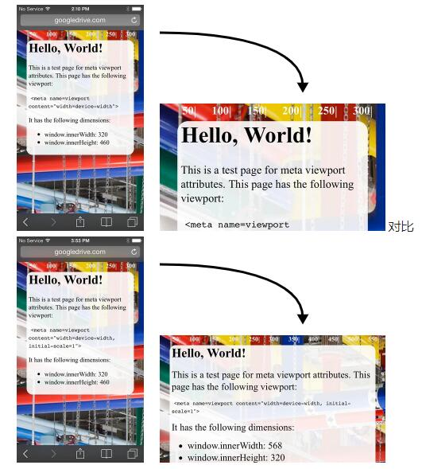

<!-- toc orderedList:0 depthFrom:1 depthTo:6 -->

* [CSS长度单位](#css长度单位)
    * [px](#px)
    * [em](#em)
    * [rem](#rem)
    * [vh and vw](#vh-and-vw)
    * [vmin and vmax](#vmin-and-vmax)
    * [ex and ch](#ex-and-ch)
    * [CSS像素定义](#css像素定义)
    * [viewport](#viewport)

<!-- tocstop -->

# CSS长度单位

## px
`px`是你屏幕设备物理上能显示出的最小的一个点。
 `px`是被定义为小但仍可见，并且水平向的1px宽的线可以清晰地显示出来的单位(无抗锯齿)。

 https://www.w3.org/Style/Examples/007/units.zh_CN.html

## em

`em` 被定义为相对于当前对象内文本的字体大小(`font-size`)。`font-size`默认会继承父级的大小。

```html
<style media="screen">
body {
    font-size: 14px;
}
div {
    font-size: 1.2em; // calculated at 14px * 1.2, or 16.8px
}
</style>
<body>
    <div>
        Test <!-- 14 * 1.2 = 16.8px -->
        <div>
            Test <!-- 16.8 * 1.2 = 20.16px -->
            <div>
                Test <!-- 20.16 * 1.2 = 24.192px -->
            </div>
        </div>
    </div>
</body>
```
<p>
<iframe height='265' scrolling='no' title='Cascading em Values' src='//codepen.io/tutsplus/embed/xbZQRQ/?height=265&theme-id=0&default-tab=html,result&embed-version=2' frameborder='no' allowtransparency='true' allowfullscreen='true' style='width: 100%;'>See the Pen <a href='http://codepen.io/tutsplus/pen/xbZQRQ/'>Cascading em Values</a> by Envato Tuts+ (<a href='http://codepen.io/tutsplus'>@tutsplus</a>) on <a href='http://codepen.io'>CodePen</a>.
</iframe>
</p>

## rem

基于一个根元素（大多数情况下是html元素）设置元素的大小。

```css
html {
    font-size: 14px;
}
div {
    font-size: 1.2rem;//14*1.2
}
```
```html
<body>
    <div>
        Test <!-- 14 * 1.2 = 16.8px -->
        <div>
            Test <!-- 14 * 1.2 = 16.8px -->
            <div>
                Test <!-- 14 * 1.2 = 16.8px -->
            </div>
        </div>
    </div>
</body>
```
## vh and vw

`1vh` 等于1/100的视口高度。

浏览器高度`900px`, `1 vh = 900px/100 = 9 px`。

同理，`vw`就是视口（`viewport`）就宽度的1/100。

## vmin and vmax


`vmin` 和 `vmax`则关于视口高度和宽度两者的最小或者最大值。

如果浏览器设置为`1100px`宽、`700px`高，`1vmin`会是`7px`,`1vmax`为`11px`。
然而，如果宽度设置为`800px`，高度设置为`1080px`，`1vmin`将会等于`8px`而`1vmax`将会是`10.8px`。

## ex and ch

`ex`和`ch`单位是基于字体（`font-family`）的度量单位，依赖于设定的字体


`ex`单位被定义为`0`字符的宽度。


```html
<div class='x' style='display:inline-block;'>xxxx</div>
<div class="line" style='display:inline-block;overflow:hidden;height:1ex;background:#aaa;width:50px;color:#fff;'>xx</div>
<div class="line" style='display:inline-block;overflow:hidden;height:2ex;background:#aaa;width:50px;color:#fff;'>xx</div>
<div class='x' style='display:inline-block;font-size:2em'>xxxx</div>
```

<h4>定义一条与字母x高度相同的线：</h4>
<div class='x' style='display:inline-block;'>xxxx</div>
<div class="line" style='display:inline-block;overflow:hidden;height:1ex;background:#aaa;width:50px;color:#fff;'>xx</div>
<div class="line" style='display:inline-block;overflow:hidden;height:2ex;background:#aaa;width:50px;color:#fff;'>xx</div>
<div class='x' style='display:inline-block;font-size:2em'>xxxx</div>

----

`ch`单位被定义为那个字体的小写`x`的高度。

```html
<style>
    h1{margin:10px 0;font-size:16px;}
    div{overflow:hidden;width:10ch;background:#ccc;}
</style>

<h1>定义一个宽度正好能装下10个0的容器：</h1>
<div>0000000000</div>
```


<h4>定义一个宽度正好能装下10个0的容器：</h4>
<div style='overflow:hidden;width:10ch;background:#ccc;'>0000000000</div>

---
>[参考](http://web.jobbole.com/82490/)

## CSS像素定义

**硬件像素**：显示器的物理像素。例如，iPhone 5所配屏幕的水平硬件像素为640。

**设备无关像素(dip)**：：计算机坐标系统中的一个点，该点代表一个可由程序使用并控制的虚拟像素，然后由相关系统转换为物理像素。此像素在所有设备上大小几乎相同，iPhone 5的设备无关像素宽度为320。

**CSS像素** 用于页面布局的单位，由视口控制。样式的像素尺寸（例如width: 100px）是以CSS像素为单位指定的。**CSS像素**与**设备无关像素**的比例即为网页的比例系数或缩放级别。

比如iPhone 5使用的是Retina视网膜屏幕，使用`2px x 2px`的 device pixel 代表 `1px x 1px `的 css pixel，所以设备像素数为`640 x 1136px`，而CSS逻辑像素数为`320 x 568px`。

```js
设备像素比 = 硬件像素/设备无关像素 // 在某一方向上，x方向或者y方向
```



添加属性`initial-scale=1`均可指示浏览器将CSS像素与设备无关像素的比例设为`1:1`（而不用考虑设备的屏幕方向），并且可让网页利用整个横向宽度。

```js
//打印台中输入

console.log(screen.availHeight);
//568
console.log(screen.availWidth);
//320
console.log(window.devicePixelRatio);
//2
```
[参考](http://ued.ourfuture.cn/fed/4200.html)

## viewport

一个空的 `div` ，其宽度默认是100%。它是继承其父元素 `body`，而`body`的宽度又是继承其父元素 `html`。所以 `body` 元素和它的父元素 `html`一样宽。

`html` 元素的宽度是被`viewport`的宽度所限制的。 `html` 元素使用`viewport`宽度的`100%`。

移动端可以添加以下设置修正屏幕大小与网页布局不一致的问题：

```html
<meta name="viewport" content="width=device-width,initial-scale=1.0,user-scalable=no" />
```
`width`决定了`layout viewport`的值。

>*viewport 的最好宽度是`ideal viewport`，用`ideal viewport`设置`layout viewport`的大小。*

>https://github.com/ant-design/ant-design-mobile/wiki/viewport%E8%AF%A6%E8%A7%A3
>http://blog.csdn.net/aiolos1111/article/details/51967744
>http://www.cnblogs.com/HCJJ/p/6347242.html
>http://www.cnblogs.com/Mrs-cc/p/5329545.html


