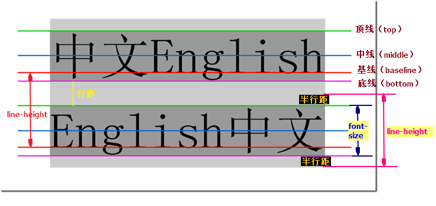
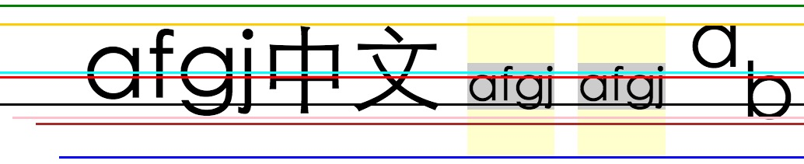
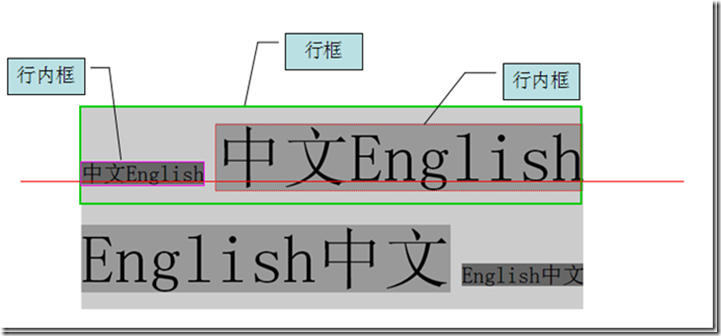

<!-- toc orderedList:0 depthFrom:1 depthTo:6 -->

* [line-height与vertical-align](#line-height与vertical-align)
    * [line-height](#line-height)
        * [4种box](#4种box)

<!-- tocstop -->

# line-height与vertical-align

## line-height


**行高(line-height)**是指文本行基线间的垂直距离。

**行距**是上一行的底线和下一行的顶线之间的距离，行距的一半是**半行距**。

```CSS
半行距 = （line-height - font-size）/2
```

半行距为负时(当line-height < font-size)，这时候两行之间就会重叠。

如果父元素的`line-height`有单位（px、%）,那么子元素继承的值则是父元素计算后的一个具体的px级别的值；

以下，P得到的是`10px*150%=15px`的行高，而P的字体大小为`30px`，所以发生了重叠。

```HTML
<div style="border:dashed 1px #0e0;line-height:150%;font-size:10px;">
    <p style="font-size:30px;">
        1232<br/>
        123
    </p>
</div>
```
<div style="border:dashed 1px #0e0;line-height:150%;font-size:10px;">
    <p style="font-size:30px;">
        1232<br/>
        123
    </p>
</div>

而如果没有单位，子元素就会根据自己的**字体大小**，与**父元素的行高数值**计算自己的行高。



上图所示线条从上到下为：

```
/*顶线*/
vertical-align:top;

vertical-align:text-top;

/*上标*/
vertical-align:super;  

/*中线*/   
vertical-align:middle;   

/*基线*/
vertical-align:baseline;  

/*下标*/
vertical-align:sub;		  

vertical-align:bottom;   

/*底线*/
vertical-align:text-bottom;
```

css中起高度作用的应该就是**height**以及**line-height**。

```css
.test1{font-size:20px; line-height:0; border:1px solid #cccccc; background:#eeeeee;}
.test2{font-size:0; line-height:20px; border:1px solid #cccccc; background:#eeeeee;}
```

```html
<div class="test1">测试</div>
<div class="test2">测试</div>
```

**效果:**


`line-height`的最终表现是通过`line boxes`实现的，而无论`line boxes`所占据的高度是多少（无论比文字大还是比文字小），其占据的空间都是与文字内容共用水平线的

### 4种box

 - inline box(行内框):每个**行内元素**会生成一个行内框，行内框是一个浏览器渲染模型中的一个概念，无法显示出来，行内框的高度等于`font-size`，设定`line-height`时，**行内框的高度不变，改变的是行距**。

 - line box(行框):指本行的一个虚拟的矩形框，由该行中**行内框**组成。行框也是浏览器渲染模式中的一个概念，无法显示出来。**等于最上行内框顶部到最下行内框底部的距离(保证足以容纳它所包含的所有inline-box)**。当有多行内容时，每一行都有自己的**行框**。



 - content area(内容区):内容区是围绕着文字的一种box，无法显示出来，由`text-top`与`text-bottom`包裹，其高度取决于`font-size`。
 - containing box :包裹着上述三种box的box。

>参考：
> 1. http://www.cnblogs.com/dolphinX/p/3236686.html
> 2. http://www.cnblogs.com/fengzheng126/archive/2012/05/18/2507632.html
> 3. https://sinaad.github.io/xfe/2016/04/15/css-line-height/
> 4. [css行高line-height的一些深入理解及应用--张鑫旭]( http://www.zhangxinxu.com/wordpress/2009/11/css%E8%A1%8C%E9%AB%98line-height%E7%9A%84%E4%B8%80%E4%BA%9B%E6%B7%B1%E5%85%A5%E7%90%86%E8%A7%A3%E5%8F%8A%E5%BA%94%E7%94%A8/)
