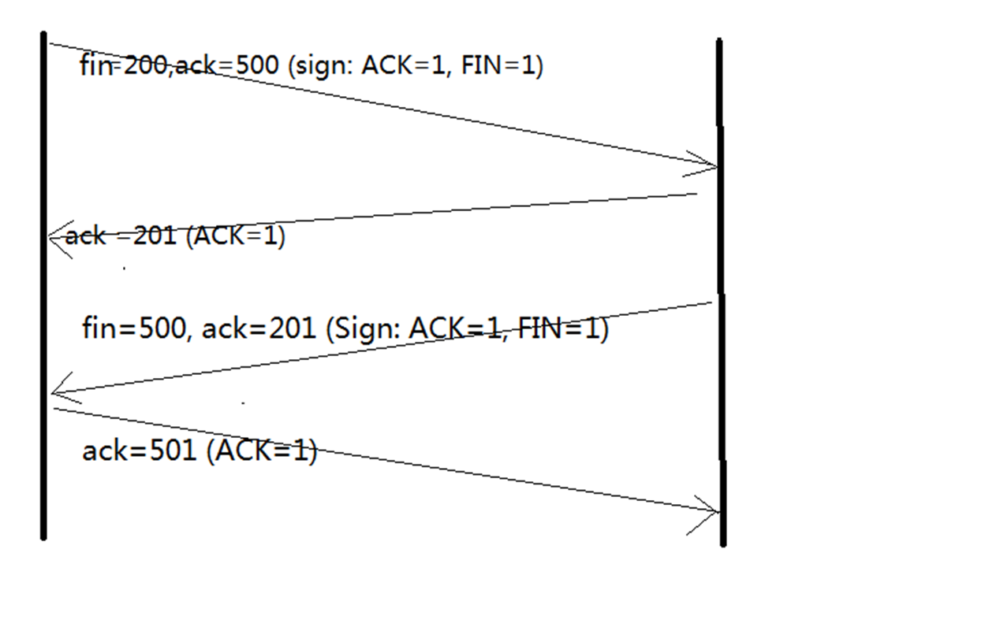

<!-- toc orderedList:0 depthFrom:1 depthTo:6 -->

* [WebSocket](#websocket)
    * [TCP的三次握手与四次分手](#tcp的三次握手与四次分手)
        * [三次握手](#三次握手)
        * [四次分手：](#四次分手)
    * [WebSocket简介](#websocket简介)
    * [实例](#实例)

<!-- tocstop -->

# WebSocket

## TCP的三次握手与四次分手
### 三次握手
TCP是主机对主机层的传输控制协议，提供可靠的连接服务，采用三次握手确认建立一个连接:

位码即tcp标志位,有6种标示:

1. SYN(synchronous建立联机)
2. ACK(acknowledgement 确认)
3. PSH(push传送)
4. FIN(finish结束)
5. RST(reset重置)
6. URG(urgent紧急)
7. Sequence number(顺序号码)
8. Acknowledge number(确认号码)

握手过程：

第一次握手：建立连接。客户端发送连接请求报文段，将`SYN`位置为1，`Sequence Number`为x；然后，客户端进入`SYN_SEND`状态，等待服务器的确认；
第二次握手：服务器收到`SYN`报文段。服务器收到客户端的`SYN`报文段，需要对这个`SYN`报文段进行确认，设置`Acknowledgment Number`为`x+1(Sequence Number+1)`；同时，自己还要发送`SYN`请求信息，将`SYN`位置为1，`Sequence Number`为y；服务器端将上述所有信息放到一个报文段（即`SYN+ACK`报文段）中，一并发送给客户端，此时服务器进入`SYN_RECV`状态；
第三次握手：客户端收到服务器的`SYN+ACK`报文段。然后将`Acknowledgment Number`设置为y+1，向服务器发送`ACK`报文段，这个报文段发送完毕以后，客户端和服务器端都进入`ESTABLISHED`状态，完成`TCP`三次握手；


### 四次分手：

由于TCP连接是全双工的，因此每个方向都必须单独进行关闭。这个原则是当一方完成它的数据发送任务后就能发送一个`FIN`来终止这个方向的连接。收到一个 `FIN`只意味着这一方向上没有数据流动，一个`TCP`连接在收到一个`FIN`后仍能发送数据。首先进行关闭的一方将执行主动关闭，而另一方执行被动关闭。

操作：

1. 客户端A发送一个`FIN`，用来关闭客户A到服务器B的数据传送。
2. 服务器B收到这个`FIN`，它发回一个`ACK`，确认序号为收到的序号加1。和`SYN`一样，一个`FIN`将占用一个序号。
3. 服务器B关闭与客户端A的连接，发送一个`FIN`给客户端A。
4. 客户端A发回`ACK`报文确认，并将确认序号设置为收到序号加1。



>参考：
1. http://www.jellythink.com/archives/705
2. http://www.cnblogs.com/Jessy/p/3535612.html
3. https://www.zhihu.com/question/24853633

## WebSocket简介

WebSocket协议是基于`TCP`的一种新的网络协议。它实现了浏览器与服务器全双工(`full-duplex`)通信——可以通俗的解释为服务器主动发送信息给客户端。
只需要经过一次`HTTP`请求，就可以做到源源不断的信息传送了（在程序设计中，这种设计叫做回调，即：你有信息了再来通知我）。

客户端请求：
```
GET /chat HTTP/1.1
Host: server.example.com
Upgrade: websocket
Connection: Upgrade
Sec-WebSocket-Key: x3JJHMbDL1EzLkh9GBhXDw==
Sec-WebSocket-Protocol: chat, superchat
Sec-WebSocket-Version: 13
Origin: http://example.com
```
`Upgrade: websocket`、`Connection: Upgrade`表示希望将http协议升级到Websocket协议。
`Sec-WebSocket-Key`是一个经过base64编码的随机字节。
`Sec-WebSocket-Protocol`表示客户端支持的协议列表。
`Sec-WebSocket-Version`:是告诉服务器所使用的Websocket Draft（协议版本）。
`Origin`字段是可选的，表示在浏览器中发起此Websocket连接所在的页面。


服务端响应：

```
HTTP/1.1 101 Switching Protocols
Upgrade: websocket
Connection: Upgrade
Sec-WebSocket-Accept: HSmrc0sMlYUkAGmm5OPpG2HaGWk=
Sec-WebSocket-Protocol: chat
```
`Sec-WebSocket-Accept`:是把`Sec-WebSocket-Key`加上一个特殊字符串“`258EAFA5-E914-47DA-95CA-C5AB0DC85B11`”，然后计算**SHA-1**摘要，之后进行**BASE-64**编码，将结果做为`Sec-WebSocket-Accept`头的值，返回给客户端。


>参考：
>1.[知乎](https://www.zhihu.com/question/20215561 'zhihu')
>2.[维基百科](https://zh.wikipedia.org/wiki/WebSocket '中文')

## 实例

服务器端：

```js
const WebSocket = require('ws');

const WebSocketServer = WebSocket.Server;

const wss = new WebSocketServer({
    port: 3000
});

//启动服务链接
wss.on('connection', function (ws) {
    console.log(`[SERVER] connection()`);
    //监听有否有请求信息
    ws.on('message', function (message) {
        console.log(`[SERVER] Received: ${message}`);
        setTimeout(() => {
            //定时给客户端发送信息
            ws.send(`What's your name?`, (err) => {
                if (err) {
                    console.log(`[SERVER] error: ${err}`);
                }
            });
        }, 1000);
    })
});

console.log('ws server started at port 3000...');
```

客户端：

```js
const WebSocket = require('ws');
let count = 0;
let ws = new WebSocket('ws://localhost:3000/ws/chat');
//打开链接，给服务器发送一条信息
ws.on('open', function () {
    console.log(`[CLIENT] open()`);
    ws.send('Hello!');
});
//监听服务器是否有信息发送过来
ws.on('message', function (message) {
    console.log(`[CLIENT] Received: ${message}`);
    count++;
    if (count > 3) {
        ws.send('Goodbye!');
        ws.close();
    } else {
        setTimeout(() => {
            ws.send(`Hello, I'm Mr No.${count}!`);
        }, 1000);
    }
});
```

运行后：

```shell
ws server started at port 3000...
[SERVER] connection()
[CLIENT] open()
[SERVER] Received: Hello!
[CLIENT] Received: What's your name?
[SERVER] Received: Hello, I'm Mr No.1!
[CLIENT] Received: What's your name?
[SERVER] Received: Hello, I'm Mr No.2!
[CLIENT] Received: What's your name?
[SERVER] Received: Hello, I'm Mr No.3!
[CLIENT] Received: What's your name?
[SERVER] Received: Goodbye!
[SERVER] error: Error: not opened

end'
```
>参考：[websocket](http://www.liaoxuefeng.com/wiki/001434446689867b27157e896e74d51a89c25cc8b43bdb3000/0014727922914053479c966220f47da91991fa9c27ac3ea000 '廖雪峰JavaScript教程')
