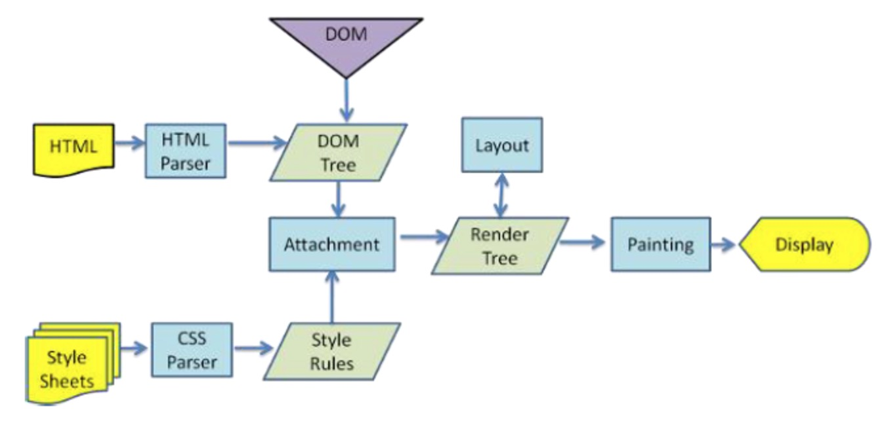
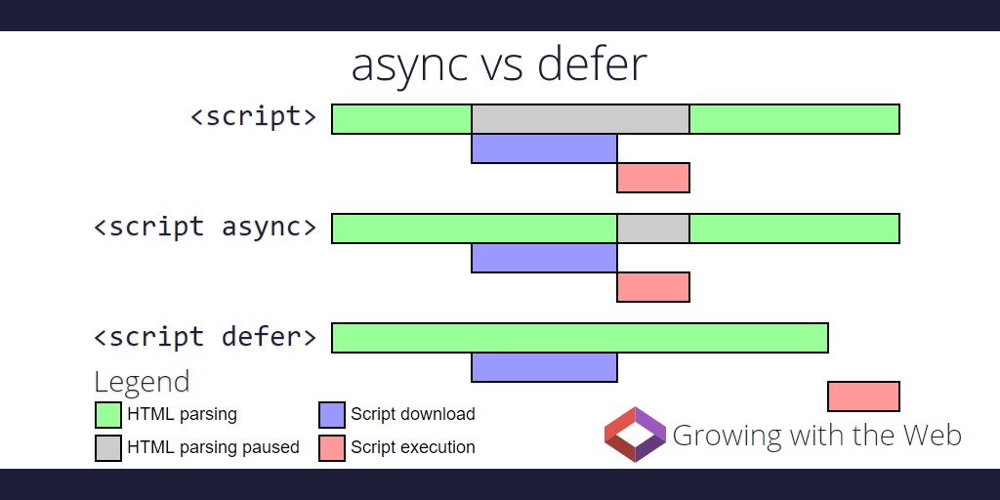

<!-- toc orderedList:0 depthFrom:1 depthTo:6 -->

* [浏览器渲染](#浏览器渲染)
    * [谷歌开发者工具](#谷歌开发者工具)
    * [浏览器加载、解析与渲染](#浏览器加载-解析与渲染)
    * [关键渲染路径](#关键渲染路径)
    * [javascript异步加载](#javascript异步加载)
        * [defer属性](#defer属性)
        * [async](#async)

<!-- tocstop -->

# 浏览器渲染

## 谷歌开发者工具


Timeline

1. 控制条:
    开始记录，停止记录
    配置记录期间捕获的信息。


2. 总览:
    页面性能高级汇总


3. 火焰图:
    CPU 堆叠追踪的可视化


4. 详情:
    每个CPU任务的详细报告

## 浏览器加载、解析与渲染

1. DOM是增量构建的，不需要等整个文档下载完才可以构建DOM树。
2. 样式将被载入和解析，构成层叠样式表模型CSSOM(CSS Object Model).
3. DOM 和 CSSOM 合并后生成 Render Tree(Render Tree 和DOM一样，以多叉树的形式保存了每个节点的css属性、节点本身属性、以及节点的孩子节点）
4. Render Tree（渲染树）构建完毕之后，进入“布局”处理阶段，也就是为每个节点分配一个应出现在屏幕上的确切坐标。这就被称为`reflow`或者是`layout`又或者是`layouting`。
5. 最后，浏览器会在屏幕上绘制节点。

衍生的问题解析：

1. HTML是解析一部分，显示一部分的。
2. `<script>`标签会阻塞文档的解析，知道脚本执行完毕。如果脚本是外部的，需等到脚本下载并执行完成才继续往下解析。
3. css不会阻止HTML解析，但CSS还没有加载完时会阻碍HTML渲染与JavaScript脚本运行。
4. 图片资源是异步请求的，图片既不阻塞解析，也不阻塞渲染。
5. 屏幕的变化称为`repaint`或者`redraw`。

>参考：
> 1. https://segmentfault.com/a/1190000007766425#articleHeader4
> 2. https://segmentfault.com/a/1190000006917754



文档的渲染还是要等待顶层css加载完毕。

## 关键渲染路径

```html
<html>
<head>
  <title>Understanding the Critical Rendering Path</title>
  <link rel="stylesheet" href="style.css">
</head>
<body>
  <header>
      <h1>Understanding the Critical Rendering Path</h1>
  </header>
  <main>
      <h2>Introduction</h2>
      <p>Lorem ipsum dolor sit amet</p>
  </main>
  <footer>
      <small>Copyright 2017</small>
  </footer>
  <script src="main.js"></script>
</body>
</html>
```


1. 发送请求：发送GET请求index.html
2. 解析HTML然后发送请求：开始解析HTML并构建DOM，然后发送GET请求style.css和main.js。
3. 解析样式表：根据style.css生成CSSOM
4. 执行计算脚本：执行main.js
5. 布局：基于HTML的元视窗标签，生成布局
6. 绘制页面：绘制网页

>参考：
>[理解浏览器的关键渲染路径]( https://github.com/lx7575000/Translation/blob/master/%EF%BC%88%E8%AF%91%EF%BC%89%E7%90%86%E8%A7%A3%E6%B5%8F%E8%A7%88%E5%99%A8%E7%9A%84%E5%85%B3%E9%94%AE%E6%B8%B2%E6%9F%93%E8%B7%AF%E5%BE%84/%EF%BC%88%E8%AF%91%EF%BC%89%E7%90%86%E8%A7%A3%E6%B5%8F%E8%A7%88%E5%99%A8%E7%9A%84%E5%85%B3%E9%94%AE%E6%B8%B2%E6%9F%93%E8%B7%AF%E5%BE%84.md)

## javascript异步加载

### defer属性

 - 当script标签拥有defer属性时，该脚本会被推迟到整个HTML文档解析完后，再开始执行
 - 被defer的脚本，在执行时会严格按照在HTML文档中出现的顺序执行

### async

 - 当script标签拥有async属性时，该脚本不会再阻塞HTML parser。且不会被CSS阻塞。
 - 脚本**只要加载完成**，便可开始执行。
 - 被async的脚本，在执行时**不会**严格按照在HTML文档中出现的顺序执行
 - async适用于无依赖的独立资源



><https://ppt.baomitu.com/d/258e0812#/57>

## 浏览器重绘与回流

当`render tree`中的一部分（或全部）因为元素的规模尺寸、布局、隐藏等改变而需要重新构建，称为**回流(reflow)** 。
当页面布局和集合属性改变，会出发回流。

当`render tree`中的一些元素需要重新更新属性，而这些属性只是影响元素外观、风格，不会影响布局的修改(如background-color)，称为**重绘(repaint)**。
