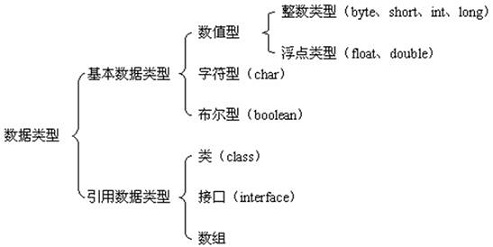
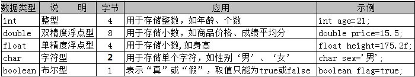
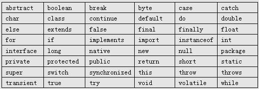

<!-- @import "[TOC]" {cmd:"toc", depthFrom:1, depthTo:6, orderedList:false} -->

<!-- code_chunk_output -->

* [Java基础](#java基础)
	* [变量](#变量)
	* [数据类型](#数据类型)
		* [自动类型转换](#自动类型转换)
		* [强制类型转换](#强制类型转换)
		* [常量](#常量)
	* [数组](#数组)
		* [定义数组变量](#定义数组变量)
		* [直接初始化数据](#直接初始化数据)
	* [对象](#对象)
		* [包裹类型](#包裹类型)
		* [new创建](#new创建)
	* [构造函数](#构造函数)
	* [访问属性](#访问属性)
	* [关键字](#关键字)
	* [运算符](#运算符)

<!-- /code_chunk_output -->


# Java基础

所有的Java 程序由`public static void main(String []args)`方法开始执行。
Java因强制要求类名（唯一的public类）和文件名统一

## 变量

三个元素描述变量：**变量类型**、**变量名** 以及 **变量值**。

```java
String        love    =      "hei,girl";
变量类型        变量名          变量值
```

## 数据类型
Java 语言是一种**强类型**语言。Java 中存储的数据都是有类型的，而且必须在编译时就确定其类型。



| 数据类型|最大值|最小值|描述|
|--------|------|-----|-----|
|byte| 127（2^7-1）| -128（-2^7）|8位、有符号的，以二进制补码表示的整数|
|short |32767（2^15 - 1）|-32768（-2^15）|16 位、有符号的以二进制补码表示的整数|
|int| 2,147,483,647（2^31 - 1）|2,147,483,648（-2^31）|32位、有符号的以二进制补码表示的整数|
|long|9,223,372,036,854,775,807（2^63 -1）|-9,223,372,036,854,775,808（-2^63）|64 位、有符号的以二进制补码表示的整数|
|float|略 |略|单精度、32位、符合IEEE 754标准的浮点数|
|double|略|略|双精度、64位、符合IEEE 754标准的浮点数|
|boolean | 略|略|表示一位的信息(true/false)|
|char| uffff（即为65,535）| \u0000（即为0）|单一的 16 位 Unicode 字符|

> long 类型的数据一定要在数值后面加上 L，否则将作为整型解析

基本数据类型变量存的是数据本身，而引用类型变量存的是保存数据的空间地址。



1. 不能对boolean类型进行类型转换。
2. 不能把对象类型转换成不相关类的对象。
3. 在把容量大的类型转换为容量小的类型时必须使用强制类型转换。
4. 转换过程中可能导致溢出或损失精度

```
低  ------------------------------------>  高

byte,short,char—> int —> long—> float —> double
```

### 自动类型转换


### 强制类型转换

强制类型转换可能会造成数据的丢失。

```java
// 语法：
// (数据类型)数值

doubel num=23.43;
int num1=(int)num;
System.out.println(num1);
//23
```

### 常量

常量值被设定后，在程序运行过程中不允许改变。

```java
// 语法
// final name=value

final String NUM=33;
final double PI=3.14;
```

## 数组

### 定义数组变量

    <类型>[] <名字>=new <类型>[元素个数]


```java
int[] arr=new int[100];
double[] arr=new double[10];

// 或者
int [] ia={1,23,4,5,90,6,7,8,33};
```

 - 元素个数必须是整数
 - 元素个数必须给出
 - 元素个数可以是变量

### 直接初始化数据

```java
int[] arr={1,2,3,4,5}
```

## 对象

### 包裹类型

每个基础类型都有对应的包裹类型。

| 基础类型| 包裹类型 |
|-------|-------|
|boolean|Boolean|
|char   |Character|
|int    |Integer    |
|double|Double|

可以用包裹类型定义变量，也可以做一些特殊的操作。

```java
//定义遍历
int i=10;
Integer k=10;
k=i;

Character.isDigit('1')
//true

Integer.MAX_VALUE
//2147483647
```

### new创建

使用`new`创建一个新的对象，需要三步：

1. **声明：** 声明一个对象，包括对象名称和对象类型。
2. **实例化：** 使用关键字new来创建一个对象。
3. **初始化：** 使用new创建对象时，会调用构造方法初始化对象。


```java
public class Puppy{
   public Puppy(String name){
      //这个构造器仅有一个参数：name
      System.out.println("小狗的名字是 : " + name );
   }
   public static void main(String []args){
      // 下面的语句将创建一个Puppy对象
      Puppy myPuppy = new Puppy( "tommy" );
   }
}
```

## 构造函数

如果有一个成员函数的名字和类的名字完全相同，则创建这个类的每一个对象的时候都会自动调用这个函数 --> 构造函数。

构造函数的名称必须与类同名，一个类可以有多个构造函数。

```java
package vendingMachine;

public class VendingMachine {
	int price=80;

	void showPrompt() {
		System.out.println("welcome");
	}
	// 会首先执行
	VendingMachine(int price){
		this.price=price;
	}

	public static void main(String[] args) {
		// 会执行有相同参数的构造函数
		VendingMachine vm=new VendingMachine(100);
		// 执行这个类的showPrompt方法
		vm.showPrompt();
	}

}
```

## 访问属性

**private**

 - 只有这个类内部可以访问
	 - 类的内部指类的成员函数和定义初始化
	 - 这个限制是对类的而不是对对象的


**public**

 - 任何人都可以访问
	 - 任何人指的是在任何类的函数或初始化中可以使用
	 - 使用指的是调用、访问或者定义变量


```java
//任何人都可以用这个类定义变量，必须与这个文件名一样
//一个编译单元只有一个public class
public class Clock {
	// 限制非本类的对象访问本类对象的private属性
	private Display minute=new Display(60);

	public void start(){
			minute.increase();
			// 。。。
	}
	public static void main(String[] args) {
		Clock clock=new Clock();
		clock.start();
	}
}
```

## 关键字



**标识符规则**

 - 标识符可以由字母、数字、下划线（ _ ）、美元符（ $ ）组成，但不能包含 @、%、空格等其它特殊字符，不能以数字开头。
 - 标识符不能是 Java 关键字和保留字（ Java 预留的关键字，以后的升级版本中有可能作为关键字），但可以包含关键字和保留字
 - 标识符是严格区分大小写的。
 - 标识符的命名最好能反映出其作用

## 运算符

 - 算术运算符

 - 赋值运算符

 - 比较运算符

 - 逻辑运算符

 - 条件运算符

## 静态变量

如果希望一个类的所有对象共享一个成员，可使用`static`修饰。

```js
public class HelloWorld {

    // 定义静态变量，
	static String country = "China";

	public static void main(String[] args) {

		// 访问静态变量，
		System.out.println(HelloWorld.country);
	}
}
```

定义公有静态变量

```java
public static int num=10;
```

`static`修饰方法，也称静态方法或者类方法。

1.静态方法中可以直接调用同类中的静态成员，但不能直接调用非静态成员。

```java
public class HelloWorld{
	String name = "hei,boy";

	static String hobby= "running";
	public static void print(){

		//此行报错，要访问非静态变量，可以通过创建类对象。
		//HelloWorld hello = new HelloWorld();
		System.out.println(name);
		System.out.println(hobby);
	}
}
```

2.在普通成员方法中，则可以直接访问同类的非静态变量和静态变量。

```java
String name = "hei,boy";

static String hobby= "running";

public void show(){
	System.out.println(name);
	System.out.println(hobby);
}
```

3.静态方法中能直接调用静态方法，但不能直接调用非静态方法，需要通过对象来访问非静态方法。

```java
public void show(){
	System.out.println("welcome");
}

public static void print(){
	System.out.println("欢迎")：
}

public static void main(String[] args) {
	//通过对象调用
	HelloWorld hello = new HelloWorld();
	hello.show();
	// 静态方法直接调用
	print();
}
```
### 初始化

静态初始化块只在类加载时最先被执行，且只会执行一次。

```java
public class MainTwo {

    String name; // 声明变量name
	String sex; // 声明变量sex
	static int age;// 声明静态变量age

    // 构造方法
	public  MainTwo () {
		System.out.println("通过构造方法初始化name");
		name = "tom";
	}

    // 初始化块
	{
		System.out.println("通过初始化块初始化sex");
		sex = "男";
	}

    // 静态初始化块
	      static   {
		System.out.println("通过静态初始化块初始化age");
		age = 20;
	}

	public void show() {
		System.out.println("姓名：" + name + "，性别：" + sex + "，年龄：" + age);
	}

	public static void main(String[] args) {

        // 创建对象
		MainTwo hello = new MainTwo();
		// 调用对象的show方法
        hello.show();

		MainTwo hello02 = new MainTwo();
        hello02.show();
	}
}

//通过静态初始化块初始化age
// 通过初始化块初始化sex
// 通过构造方法初始化name
// 姓名：tom，性别：男，年龄：20
// --------
// 通过初始化块初始化sex
// 通过构造方法初始化name
// 姓名：tom，性别：男，年龄：20
```
初始化顺序：类初始化 >> 普通初始化 >> 执行方法
