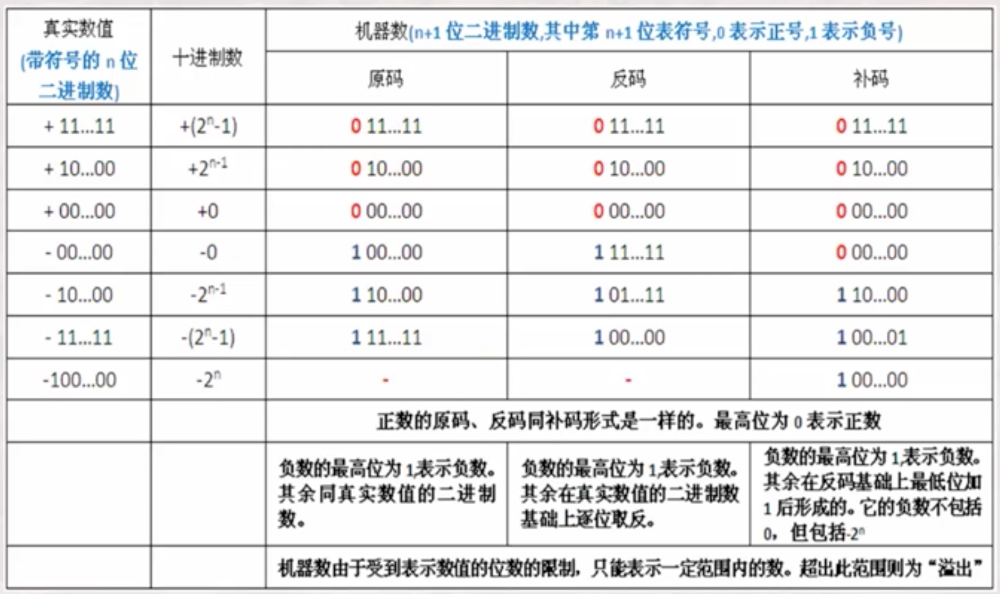

# C语言

## 数据类型

整数

 - int
 - printf("%d",...)
 - scanf("%d",...)•

带⼩小数点的数

 - double•printf("%f",...)
 - scanf("%lf",...)

### 类型区别

 - 类型名称：int、long、double
 - 输⼊入输出时的格式化：%d、%ld、%lf
 - 所表达的数的范围：char < short < int < float < double
 - 内存中所占据的⼤大⼩小：1个字节到16个字节
 - 内存中的表达形式：二进制数（补码）、编码

## 机器数以及源码、反码和补码

各种数据在计算机中表示的形式称为`机器数`。`机器数`有无符号和带符号之分。

原码就是原始的机器数。

原码表示法在数值前面增加了一位符号位（即最高位为符号位）：正数该位为0，负数该位为1，其余位表示数值的大小。

正数： 原码、反码、补码相同；

 - 负数：
    1. 原码的符号位为1，数值部分去绝对值的二进制。
    2. 反码的符号位为1，其他位置是原码取反。
    3. 补码是符号位为1，其他位置原码取反，末尾加1(等于补码加1)。

机器数的加减法建议换算成补码来计算的，然后再换回原码。
>参考：http://www.cnblogs.com/zhangziqiu/archive/2011/03/30/ComputerCode.html
