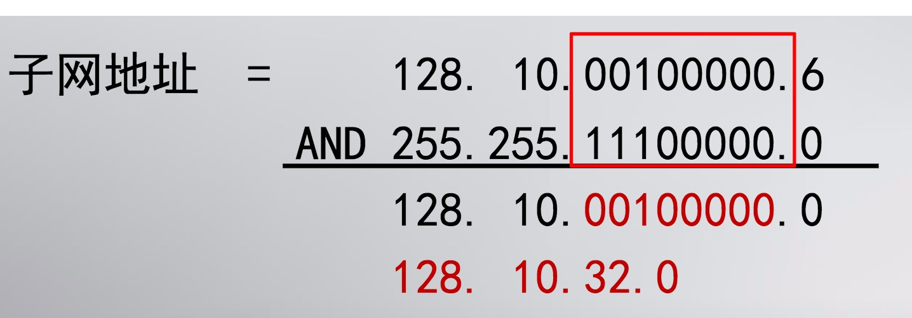
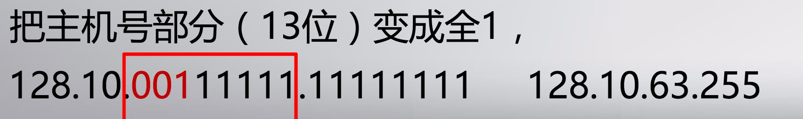

# IP地址

IP地址是一个32位的二进制数，通常被分割为4个“`8位二进制数`”。

IP地址分为`网络地址`和`主机地址`两部分。

IP地址分为A、B、C、D、E5类，适用于大型网络、中型网络、小型网络、多点地址、备用地址。常用的是B和C两类。

<table log-set-param="table_view" class="table-view log-set-param"><tbody><tr><td width="46" align="center" valign="center">
类别

</td><td width="84" align="center" valign="center">
最大网络数

</td><td width="182" align="center" valign="center">
IP地址范围

</td><td width="71" align="center" valign="center">
最大主机数

</td><td width="193" align="center" valign="center">私有IP地址范围</td></tr><tr><td width="46" align="center" valign="center">
A

</td><td width="84" align="center" valign="center">
126（2^7-2)

</td><td width="182" align="center" valign="center">
0.0.0.0-127.255.255.255

</td><td width="71" align="center" valign="center">
16777214

</td><td width="193" align="center" valign="center">
10.0.0.0-10.255.255.255

</td></tr><tr><td width="46" align="center" valign="center">
B

</td><td width="84" align="center" valign="center">
16384(2^14)

</td><td width="182" align="center" valign="center">128.0.0.0-191.255.255.255</td><td width="71" align="center" valign="center">
65534

</td><td width="193" align="center" valign="center">172.16.0.0-172.31.255.255</td></tr><tr><td width="46" align="center" valign="center">
C

</td><td width="84" align="center" valign="center">
2097152(2^21)

</td><td width="182" align="center" valign="center">192.0.0.0-223.255.255.255</td><td width="71" align="center" valign="center">
254

</td><td width="193" align="center" valign="center">192.168.0.0-192.168.255.255</td></tr></tbody></table>

D类IP地址叫多点广播地址，范围从`224.0.0.0`到`239.255.255.255`。多点广播地址用来一次寻址一组计算机，它标识共享同一协议的一组计算机。

E类IP地址以`11110`开头的地址都留着将来作为特殊用途使用

全零(`0.0.0.0`)地址对应于当前主机。全**1**的IP地址(`255.255.255.255`)是当前子网的广播地址。

以`127`开头的是回送地址(`127.x.x.x`)，用于网络软件测试以及本地机进程间通信，不进行任何网络传输。

## 子网编址

多个物理网络可以共用一个网络前缀，叫`划分子网`。

从主机域中借用若干个比特作为子网号`subnet-id`，而主机号`host-id` 也就相应减少了若干个比特。

IP 地址= [ 网络号，子网号，主机号 ]

子网号的位数是可变的，为了反映有多少位用于表示子网号，采用子网掩码( mask )
IP 地址= [ 网络号，子网号，主机号]
子网掩码= [ 11....11, 11...11,  00....00]
>网络号与子网号都用1表示，主机号用0表示。

### 子网地址
子网地址也是一个特殊的IP地址，就是网络号部分和子网号部分不变，主机号部分全`0`的地址。

>IP地址是128.10.32.6，子网掩码是255.255.224.0

### 广播地址

广播地址的特点是网络号部分和子网号部分不变，主机号部分全为`1`。

>在子网128.10.32.0中
