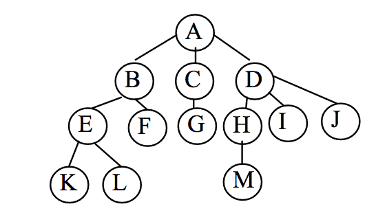
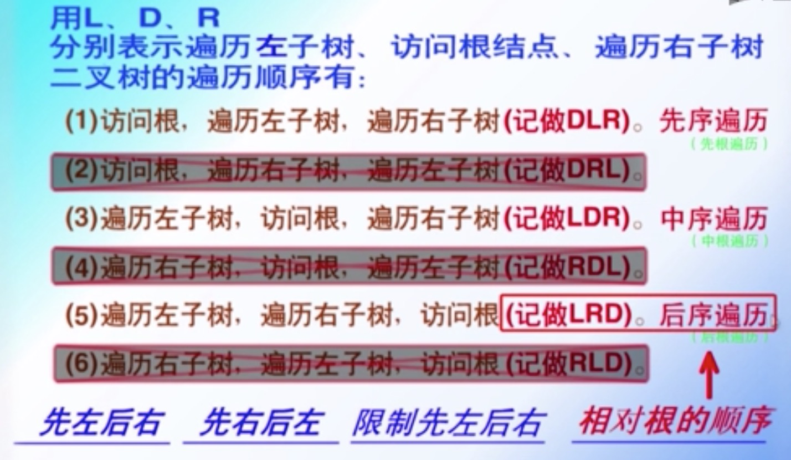
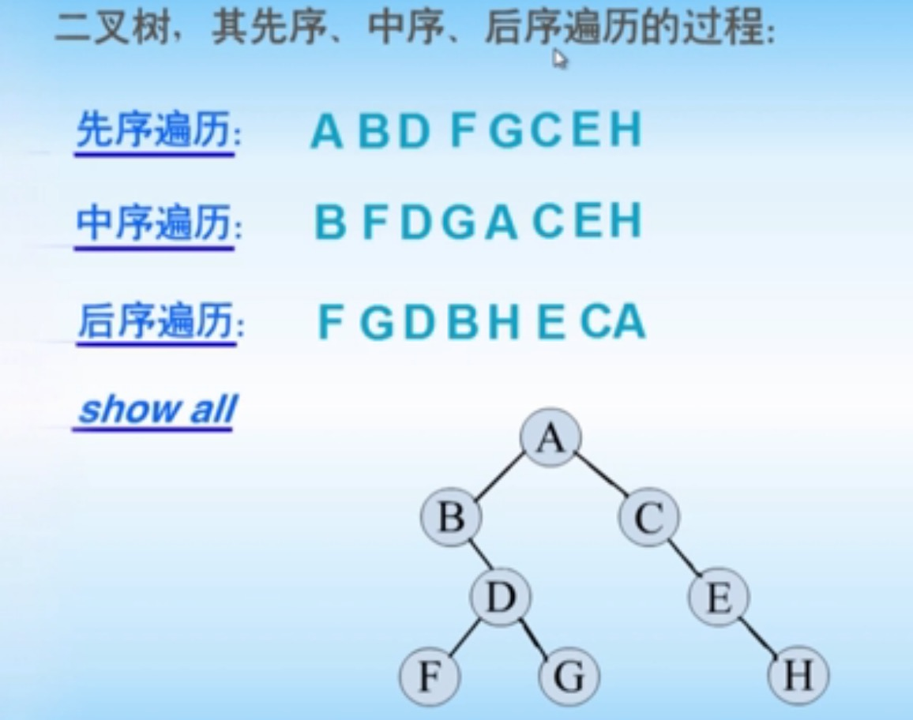

<!-- toc orderedList:0 depthFrom:1 depthTo:6 -->

- [数据结构](#数据结构)
	- [树的概念](#树的概念)
	- [树的定义](#树的定义)
	- [二叉树遍历方法](#二叉树遍历方法)

<!-- tocstop -->

# 数据结构

## 树的概念

树是n（n≥0）个结点的有限集合T。当n=0时，称为空树；当n>0时，该集合满足如下条件：

1. 其中必有一个称为根（root）的特定结点，它没有直接前驱，但有零个或多个直接后继。

2. 其余n-1个结点可以划分成m（m≥0）个互不相交的有限集T1，T2，T3，...，Tm，其中Ti又是一棵树，称为`根的子树`。每棵子树的`根结点`有且仅有一个直接前驱，但有零个或多个直接后继

## 树的定义

 - **结点**：包括一个数据元素及若干指向其他结点的分支信息。

 - **结点的度**：一个结点的子树个数称为此结点的度。

 - **叶结点**：度为0的结点，即无后继的结点，也称为终端结点。

 - **分支结点**：度不为0的结点，也称为非终端结点。

 - **结点的层次**：从根结点开始定义，根结点的层次为1，根的直接后继的层次为2，依此类推。

 - **结点的层序编号**：将树中的结点按从上层到下层、同层从左到右的次序排成一个线性序列，依次给它们编以连续的自然数。

 - **树的度**：树中所有结点的度的最大值。

 - **树的高度（深度）**：树中所有结点的层次的最大值。

 - **有序树**：在树T中，如果各子树Ti之间是有先后次序的，则称为有序树。

 - **森林**：m（m≥0）棵互不相交的树的集合。将一棵非空树的根结点删去，树就变成一个森林；反之，给森林增加一个统一的根结点，森林就变成一棵树。

 - **同构**：对两棵树，通过对结点适当地重命名，就可以使两棵树完全相等（结点对应相等，对应结点的相关关系也相等），则称这两棵树同构。
 我们常常借助人类家族树的术语，以便于直观理解结点间的层次关系。

 - **孩子结点**：一个结点的直接后继称为该结点的孩子结点。在上图中，B、C是A的孩子。

 - **双亲结点**：一个结点的直接前驱称为该结点的双亲结点。在上图中，A 是B、C的双亲。
 兄弟结点：同一双亲结点的孩子结点之间互称兄弟结点。在上图中，结点H、I、J互为兄弟。

 - **堂兄弟**：父亲是兄弟关系或堂兄关系的结点称为堂兄弟结点。在上图中，结点E、G、H互为堂兄弟。

 - **祖先结点**：一个结点的祖先结点是指从根结点到该结点的路径上的所有结点。在上图中，结点K的祖先是A、B、E。

 - **子孙结点**：一个结点的直接后继和间接后继称为该结点的子孙结点。在上图中，结点D的子孙是H、I、J、M。

 - **前辈**：层号比该结点小的结点，都称为该结点的前辈。在上图中，结点A、B、C、D都可称为结点E的前辈。

 - **后辈**：层号比该结点大的结点，都称为该结点的后辈。在上图中，结点K、L、M都可称为结点E的后辈

## 二叉树遍历方法

