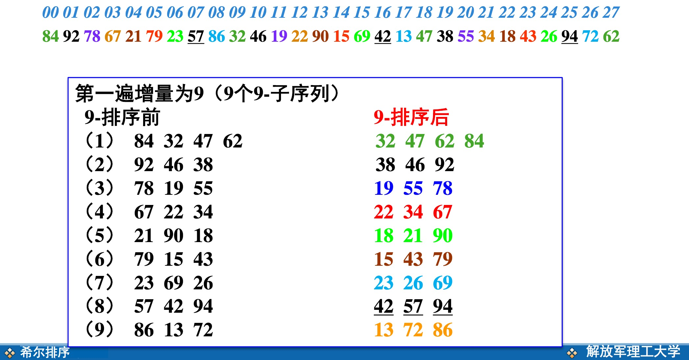
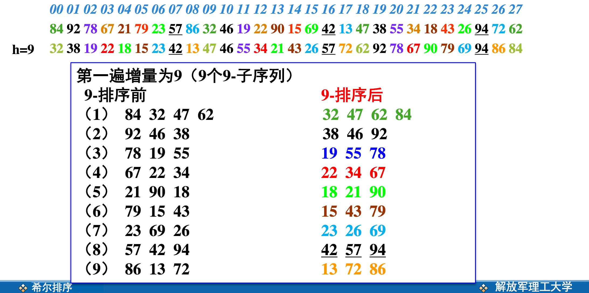
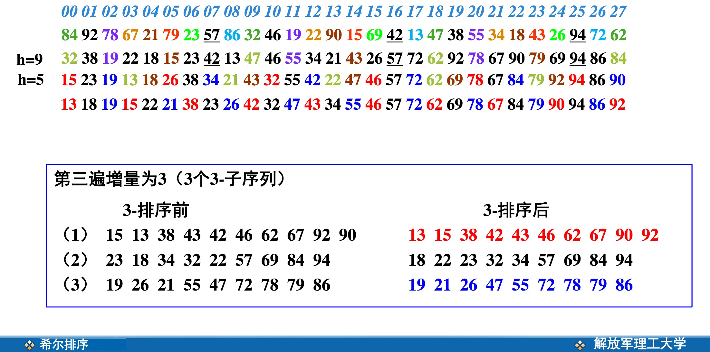
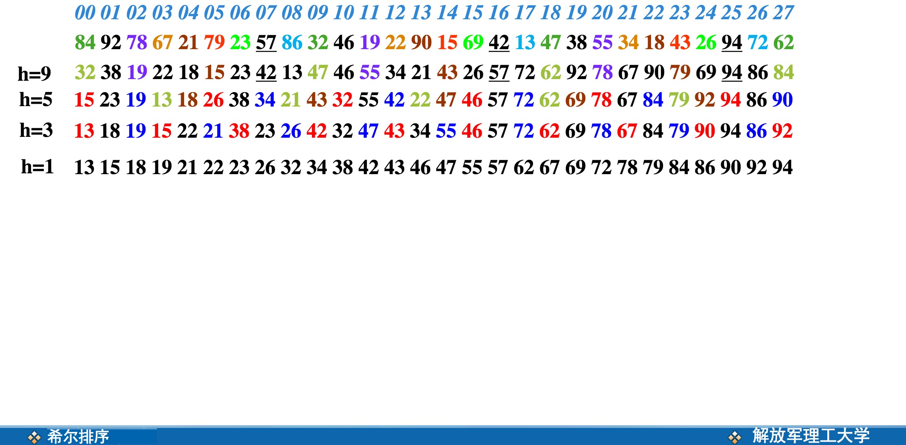
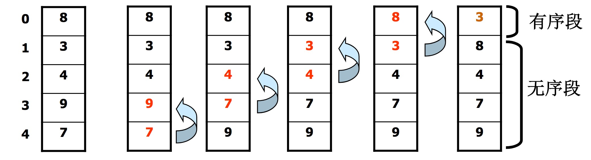
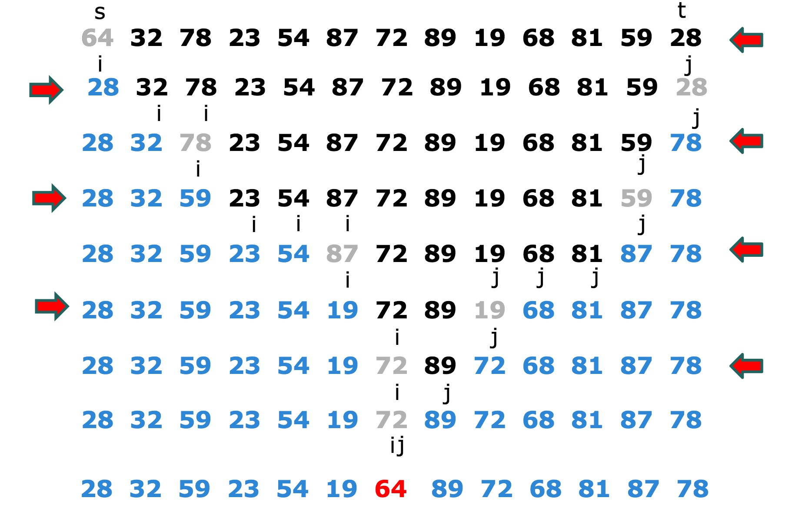

<!-- @import "[TOC]" {cmd:"toc", depthFrom:1, depthTo:6, orderedList:false} -->

<!-- code_chunk_output -->

* [算法排序](#算法排序)
	* [基本概念](#基本概念)
	* [插入排序](#插入排序)
		* [直接插入排序](#直接插入排序)
		* [二分插入排序](#二分插入排序)
		* [希尔排序](#希尔排序)
	* [冒泡排序](#冒泡排序)
	* [快速排序](#快速排序)

<!-- /code_chunk_output -->

# 算法排序

## 基本概念

空间分类：
 - 原地排序：辅助空间用量为O(l)的排序方法；
 - 非原地排序：辅助空间用量超过O(l)的排序方法；

按稳定性分类：
 - 稳定排序：能够使任何数值相等的元素，排序以后次序不变的方法；
 - 非稳定排序：不是稳定排序的方法；

>稳定性只对结构类型数据排序有意义。

按自然性分类：
 - 自然排序：输入的数据越有序，排序的速度越快的排序方法；
 - 非自然排序：不是自然排序的方法；

按数据存储介质：内部排序和外部排序；
按比较器个数：串行排序和并行排序
按主要操作：比较排序和基数排序

## 插入排序

插入排序种类：

1. 直接插入排序
2. 二分插入排序
3. 希尔排序

### 直接插入排序

 - 原始数据越接近有序，排序速度越快

 - 最坏情况下（输入数据是逆有序的）TW(n)=O(n2)

 - 平均情况下，耗时差不多是最坏情况的一半TE(n)=(n2)

 - 为提高排序速度，要
     - 减少元素的比较次数
     - 减少元素的移动次数直接插入排序

###  二分插入排序

在有序部分使用二分定位的方法比较

### 希尔排序

 - 缩小增量
 - 多遍插入排序

>例如选用增量序列（9，5，3，1），进行4遍插入排序







>图片来自[解放军理工大学慕课](http://www.icourse163.org/course/UST-1001660013#/info)

这种算法先比较部分的先后次序，再比较整体。
算法的时间复杂度与增量序列有关，计算公式为：

```js
O(n3/2),O(n(logn)2)
```

## 冒泡排序

基本原理：反复扫描待排序列，若相邻元素构成逆序，则交换它们，直至无逆序为止。

所以一次扫描，可以令最大的数或者最小的数排在最前或者最后。



## 快速排序

也称划分交换排序，原理是反复进行有序划分。
一般先选定一个数（一般为第一个），以后的数，比它大的放一边，比它小的放另一边。然后递归排序，完成排序


