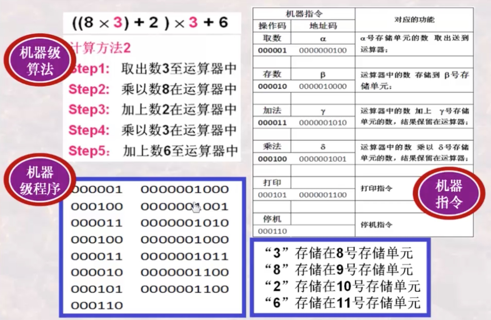
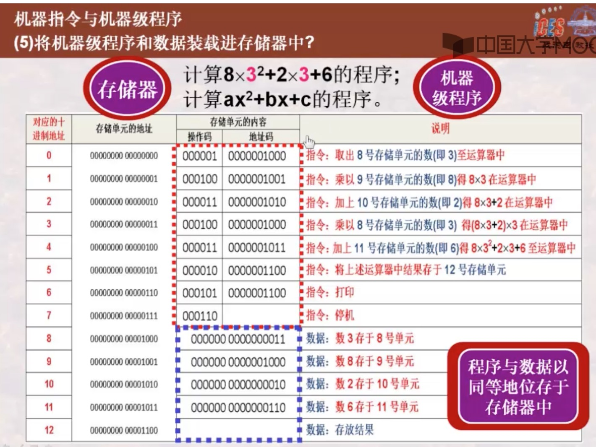
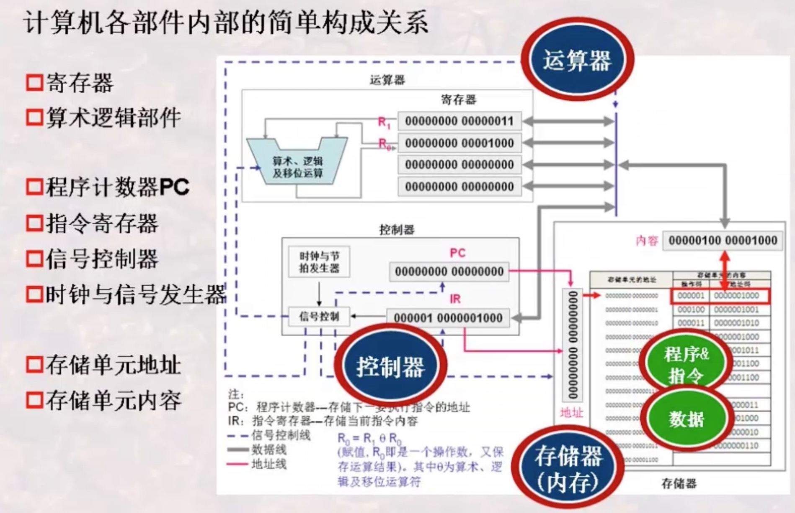

# 计算机导论
## 冯诺依曼计算机
### 机器指令

机器指令是CPU可以直接分析并执行的指令，一般用0和1编码表示。
指令≈操作码+地址码

操作码(如取数，加法等操作)|地址码(操作中的数据来源)
----|-----
000001 | 00 00000111
000100 | 00 00001010

### 机器级程序的执行

注释：
**PC**：程序计数器--存储下一个要执行指令的地址
**IR**：指令寄存器--存储当前指令内容
>课程地址：http://www.icourse163.org/course/HIT-437006
