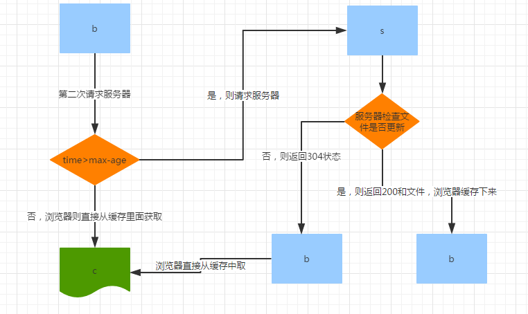

<!-- @import "[TOC]" {cmd="toc" depthFrom=1 depthTo=6 orderedList=false} -->
<!-- code_chunk_output -->

* [http模块](#http模块)
	* [简单的http服务器](#简单的http服务器)
	* [content-type与MIME类型](#content-type与mime类型)
	* [http请求缓存](#http请求缓存)
		* [Expires和Cache-Control](#expires和cache-control)
			* [max-age= < seconds >](#max-age-seconds)
			* [min-fresh = < seconds >](#min-fresh-seconds)
			* [可缓存性](#可缓存性)

<!-- /code_chunk_output -->


# http模块

## 简单的http服务器

```js
//加载一个http模块
var http = require('http');
//通过http模块下的createServer创建并返回一个web服务器对象
var server = http.createServer();

server.on('error', function(err){
    console.log(err);
});

server.on('listening', function() {
    console.log('listening...');
})

server.on('request', function(req, res) {
    console.log('有客户端请求了');

    res.writeHead(200, 'ok', {
        'content-type' : 'text/html;charset=utf-8'
    });

    res.write('<h1>hello</h1>');
    res.end();
    //跟上面那个可以合并成res.write('<h1>hello</h1>');

})

server.listen(8080, 'localhost');
//console.log(server.address());
```


 - `var http=require('http')`;

 - `var server=http.createServer([requestListener])`
     + 创建并返回一个HTTP服务器对象
     + requestListener：监听到客户端连接的回调函数

 - `server.listen([port,[hostname],[backlog],[callback]])`
     + 监听客户端连接请求，只有当调用listen方法以后，服务器才开始工作
     + port：监听的端口
     + hostname：主机名（IP/域名）
     + backlog：连接等待队列的最大长度
     + callback：调用listen方法并成功开启监听以后，会触发一个listen事件，callback将作为该事件的执行函数。

 - `error`事件：当服务开启失败的时候触发的事件
     - 参数`err`具体的错误对象。

 - `listening事件`：当server调用listen方法并成功开始监听以后触发的事件。

 - `request事件`：当有客户端发送请求道该主机和端口的请求的时候触发
     + 参数request：http.IncomingMessage的一个实例，通过他我们可以获取到这次请求的一些信息，比如信息，数据等。
     + 参数response：http:http.ServerResponse的一个实例，通过他我们可以向该请求的客户端输出返回的响应。

## content-type与MIME类型

MIME，即：Multipurpose Internet Mail Extensions，多用途互联网邮件扩展类型。

服务端利用`content-type`设置传输传输文件的`MIME`类型，浏览器经常使用`MIME`类型来决定执行何种默认行为。

```text
text/html ： HTML格式
text/plain ：纯文本格式
image/jpeg ：jpg图片格式
image/png：png图片格式

// 以application开头的媒体格式类型：

application/msword  ： Word文档格式
application/octet-stream ： 二进制流数据（如常见的文件下载）
application/x-www-form-urlencoded ： <form encType="">中默认的encType，form表单数据被编码为key/value格式发送到服务器（表单默认的提交数据的格式）

multipart/form-data ： 需要在表单中进行文件上传时，就需要使用该格式。属于细分领域的文件类型的种类
```

**通用结构**

```
type/subtype
// 由类型与子类型两个字符串中间用“/”分隔而组成。
```

类型	| 描述	|	典型示例
-----|----------|------------
 text |  表明文件是普通文本，理论上是可读的语言 |  text/plain(通用), text/html, text/css, text/javascript
 image |  表明是某种图像。不包括视频，但是动态图（比如动态gif）也使用image类型 |  mage/gif, image/png, image/jpeg, image/bmp, image/webp
 audio | 表明是某种音频文件  |  	audio/midi, audio/mpeg, audio/webm, audio/ogg, audio/wav
 video | 表明是某种视频文件  |  video/webm, video/ogg
 application | 表明是某种二进制数据  |  application/octet-stream(通用), application/pkcs12, application/vnd.mspowerpoint, application/xhtml+xml, application/xml,  application/pdf

 >https://developer.mozilla.org/zh-CN/docs/Web/HTTP/Basics_of_HTTP/MIME_types

## http请求缓存

### Expires和Cache-Control

`Expires`是`HTTP/1.0`协议字段，设置过期的时间，使用固定的时间，过期后要重新设置，用法比较死板，建议使用`Cathe-Control`。

`Cache-Control`是 `HTTP/1.1` 规范中定义的，被用于在`http`请求和响应中通过指定指令来实现缓存的机制。

#### max-age= < seconds >

`max-age`设置缓存存储的最大周期，超过这个时间缓存被认为过期(单位秒)。

浏览器首次访问，服务器返回`200`状态与内容。

浏览器再次请求服务器时，浏览器会先判断`max-age`，如果到期则直接请求服务器，否则直接从缓存中取，服务器收到请求后，判断文件是否被修改过，若是则直接返回`200`，否则返回`304`，浏览器将从缓存中获取文件。

[](https://www.cnblogs.com/zhutao/p/6690198.html)


>在max-age时间内，服务器文件有修改，这样用户就不能第一时间获取最新的信息。


#### 其他指令

 - min-fresh = < seconds >
	只在请求头有效，表示客户端希望在指定的时间内获取最新的响应。

 - public
	表明响应可以被任何对象（包括：发送请求的客户端，代理服务器，等等）缓存。

 - private
	表明响应只能被单个用户缓存，不能作为共享缓存（即代理服务器不能缓存它）。

 - no-cache
	强制所有缓存了该响应的缓存用户，在使用已存储的缓存数据前，发送带验证器的请求到原始服务器

 - only-if-cached
	表明客户端只接受已缓存的响应，并且不要向原始服务器检查是否有更新的拷贝

 - no-store
	缓存不应存储有关客户端请求或服务器响应的任何内容。

 - must-revalidate
	缓存必须在使用之前验证旧资源的状态，并且不可使用过期资源。

>https://developer.mozilla.org/zh-CN/docs/Web/HTTP/Headers/Cache-Control
