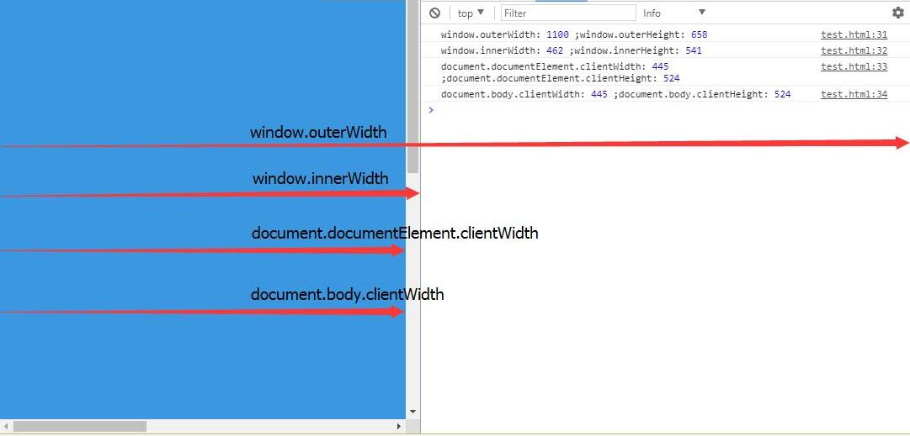

<!-- @import "[TOC]" {cmd:"toc", depthFrom:1, depthTo:6, orderedList:false} -->

<!-- code_chunk_output -->

* [DOM对象](#dom对象)
	* [this 与 e.target](#this-与-etarget)
	* [DOM对象](#dom对象-1)
	* [视口数值的获取](#视口数值的获取)
		* [object.getBoundingClientRect()](#objectgetboundingclientrect)
		* [Element.clientWidth与Element.clientHeight](#elementclientwidth与elementclientheight)
		* [window.outerWidth与window.outerHeight](#windowouterwidth与windowouterheight)
		* [window.innerWidth与window.innerHeight](#windowinnerwidth与windowinnerheight)
		* [document.body.clientWidth与document.body.clientHeight](#documentbodyclientwidth与documentbodyclientheight)

<!-- /code_chunk_output -->

# DOM对象

## this 与 e.target

js中事件是会冒泡的，所以this是可以变化的，但event.target不会变化，它永远是直接接受事件的目标DOM元素；

```html
例子1：
<html>
<head>
</head>
<body>
    <div id="T"></div>
<body>
        <script>
            var T = document.getElementById("T");
            T.onclick = function () { //用id为"T"的元素注册监听器
                alert(event.currentTarget === this); //true
                alert(event.target === this); //true
            }
        </script>
</html>
```

事件作用的元素（对象）   =   注册监听器的元素(对象)
event.currentTarget   =  this  =    event.target   =   事件作用的元素（对象）    --(例子中的T)

用最简单的语言总结：

-----|------
---------|---------
target:    |                  代表当前目标对象（事件作用的对象）
currentTarget:    |    代表注册监听器的对象
this:              |             和currentTarget一样，即它们的作用相等。

>http://www.webhek.com/event-delegate/

“事件绑定”是针对每个元素进行事件绑定处理，但是新的元素并没有进行事件绑定处理；而“事件委托”，是针对某个选择器下的某种元素，都进行事件处理。所以，只需要这些元素符合这个条件，都会进行事件处理。


## DOM对象

>DOM 全称是 Document Object Model，也就是文档对象模型。

DOM 就是针对 HTML 和 XML 提供的一个API。什么意思？就是说**为了能以编程的方法操作这个 HTML 的内容**（比如添加某些元素、修改元素的内容、删除某些元素）。

    document.title = 'how to make love';

当浏览器下载到一个网页，通常是 HTML，这个 HTML 就叫 document。

document 通常是整个 DOM 树的根节点，可以通过iframe加载更多页面。

可以通过document访问其子节点。


DOM 是为了操作文档出现的 API，document 是其的一个对象；

BOM 是为了操作浏览器出现的 API，window 是其的一个对象。

## 视口数值的获取

### object.getBoundingClientRect()

`object.getBoundingClientRect()`方法返回元素的大小及其相对于视口的位置。


```html
<div class="box" id="box" style="width:400px;margin:20px;border:1px solid #efefef;">

<script>
var len=document.getElementById('box').getBoundingClientRect();
console.dir(len);
//ClientRect {top: 20, right: 422, bottom: 222, left: 20, width: 402…}
</script>
```

### Element.clientWidth与Element.clientHeight

表示元素的内部宽度与高度，以像素计。该属性包括内边距，但不包括垂直滚动条（如果有）、边框和外边距。

### window.outerWidth与window.outerHeight

获得的是加上工具条与滚动条窗口的宽度与高度。

### window.innerWidth与window.innerHeight

获得的是可视区域的宽高，但是宽度包含了纵向滚动条的宽度。

### document.body.clientWidth与document.body.clientHeight

`document.body.clientWidth`获得的也是可视区域的宽度，但是`document.body.clientHeight`获得的是body内容的高度



>上图的`body`设置了`width:100%`,所以与`document.documentElement.clientHeight`相等。

>http://www.cnblogs.com/moqiutao/p/6639792.html