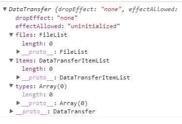

# 二进制数据事件

## paste事件

监听右键粘贴时间提供一个`clipboardData`的属性，其实是`DataTransfer`类型的对象。如果该属性有`items`属性，那么就可以查看`items`中是否有图片类型的数据了。`Chrome`有该属性，`Safari`没有。



> `files`、`items`、`types`属性是含有内容，但无法具体显示，可通过`clipboard.items[0]`获取


属性	|类型	|说明
-----|-------|-----------
dropEffect	|String	|默认是 none
effectAllowed	|String	|默认是 uninitialized
files	|FileList	|粘贴操作为空List
items	|DataTransferItemList|	剪切板中的各项数据
types|	Array	|剪切板中的数据类型 该属性在Safari下比较混乱

`items`是一个`DataTransferItemList`对象，有`kind`和`type`属性：


属性	|说明
-----|-------
kind	|一般为string或者file
type	|具体的数据类型，例如具体是哪种类型字符串或者哪种类型的文件，即MIME-Type

以及两个方法`getAsFile`与`getAsString`：

方法	|参数	|说明
-----|------|---------
getAsFile|	空	|如果kind是file，可以用该方法获取到文件
getAsString	|回调函数	|如果kind是string，可以用该方法获取到字符串，字符串需要用回调函数得到，回调函数的第一个参数就是剪切板中的字符串


一般`types`是剪切板的数据类型，常见的值有text/plain、text/html、Files。

```html
<!DOCTYPE html>
<html>
<head></head>
<body>
    <textarea id="result" style="width:800px; height:600px; resize:none"></textarea>
    <script>
        var body = document.getElementsByTagName('body')[0];
        body.addEventListener('paste', function(e){
            var clipboard = e.clipboardData;
            var type = clipboard.items[0].type;
            if (type.match(/image/)) {
                // 获取剪切板的二进制数据
                var blob = clipboard.items[0].getAsFile();

                var file = new FileReader();
                file.addEventListener('loadend', function(e){
                    document.getElementById('result').value = e.target.result;
                });
                file.readAsDataURL(blob);
            } else {
                document.getElementById('result').value = "not an image\ntype: " + type + "\n\n";
            }
        });
    </script>
</body>
</html>
```
> https://segmentfault.com/a/1190000004288686


## FileReader

`FileReader` 对象允许Web应用程序异步读取存储在用户计算机上的文件。
使用 `File` 或 `Blob` 对象指定要读取的文件或数据。

`File` 关于文件的信息对象，来自用户在一个`<input>`元素上选择文件后返回的 `FileList` 对象,也可以是来自由拖放操作生成的 `DataTransfer` 对象，或者来自 `HTMLCanvasElement` 上的 `mozGetAsFile()` API。

`BLOB (binary large object)`，二进制大对象，是一个可以存储二进制文件的**容器**。`File` 接口基于`Blob`。

可使用`new Blob()`函数构造一个`Blob对象`：

```js
var obj = {hello: "world"};
var blob = new Blob([JSON.stringify(debug,obj, 4)]);

console.log(blob);  // Blob(24) {size: 24, type: ""}

var fr = new FileReader();
fr.readAsDataURL(blob);
fr.addEventListener('loadend', function(e){
    console.log(e.target.result);   // data:;base64,ewogICAgImhlbGxvIjogIndvcmxkIgp9
});
```
> https://developer.mozilla.org/zh-CN/docs/Web/API/Blob/Blob

`FileReader`示例

```html
<script>
function showPreview(source) {
    var file = source.files[0];
    if(window.FileReader) {
        var fr = new FileReader();
        fr.onloadend = function(e) {
            document.getElementById("portrait").src = e.target.result;
        };
        fr.readAsDataURL(file);
    }
}
</script>

<input type="file" name="file" onchange="showPreview(this)" />

```

`FileReader.onload`事件在读取操作完成时触发。
当 FileReader 读取文件的方式为  `readAsArrayBuffer`, `readAsBinaryString`, `readAsDataURL` 或者 `readAsText` 的时候，会触发一个 **load** 事件。从而可以使用  `FileReader.onload` 属性对该事件进行处理，回调中包含一个事件对象(`event`)参数。

> https://developer.mozilla.org/zh-CN/docs/Web/API/FileReader

## 拖放事件与DataTransfer

一个拖放(`drap`)的实现：用户用鼠标选中一个可拖动的（`draggable`）元素，移动鼠标到一个可放置的（`droppable`）元素，然后释放鼠标。
期间会触发一系列事件，回调中都包含了一个事件对象。

在进行拖放操作时，回调函数里的事件对象参数(`DragEvent`)，包含一个`DataTransfer`属性。`DataTransfer` 对象用来保存被拖动的数据。它可以保存一项或多项数据、一种或者多种数据类型。


### 事件类型

 - **drag**
     - 拖动元素或选择文本时触发此事件。

 - **dragend**
     - 当拖动操作结束时（释放鼠标按钮或按下退出键），会触发此事件。

 - **dragenter**
     - 当拖动的元素或选择文本输入有效的放置目标时，会触发此事件。

 - **dragexit**
     - 当元素不再是拖动操作的选择目标时触发此事件。

 - **dragleave**
     - 当拖动的元素或文本选择离开有效的放置目标时，会触发此事件。

 - **dragover**
     - 当将元素或文本选择拖动到有效放置目标（每几百毫秒）上时，会触发此事件。

 - **dragstart**
     - 当用户开始拖动元素或选择文本时触发此事件。

 - **drop**
     - 当在有效放置目标上放置元素或选择文本时触发此事件。


```html
<script type="text/javascript">
    function allowDrop(ev) {
        // 默认地，无法将数据/元素放置到其他元素中。如果需要设置允许放置，我们必须阻止对元素的默认处理方式。
        ev.preventDefault();
    }

    function drag(ev) {
        ev.dataTransfer.setData("text_name", ev.target.id);
    }

    function drop(ev) {
        ev.preventDefault();
        var data = ev.dataTransfer.getData("text_name");
        ev.target.appendChild(document.getElementById(data));
    }
</script>
<div id="div1" ondrop="drop(event)" ondragover="allowDrop(event)">

    <!-- 让一个元素被拖动需要添加 draggable 属性，再加上全局事件处理函数ondragstart -->
    <span ondragstart="drag(event)" id="drag" draggable="true">hello world</span>
</div>
<div id="div2" ondrop="drop(event)" ondragover="allowDrop(event)"></div>
```

> https://developer.mozilla.org/zh-CN/docs/Web/API/HTML_Drag_and_Drop_API
> https://developer.mozilla.org/zh-CN/docs/Web/API/DataTransfer
