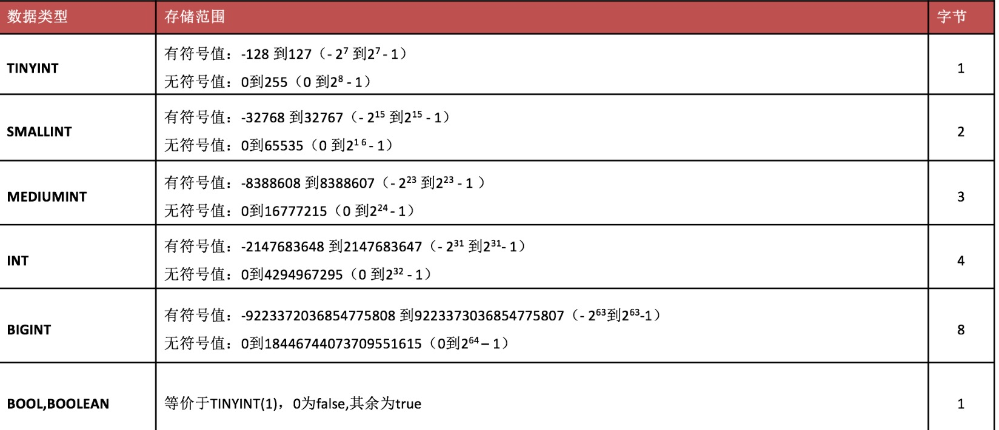
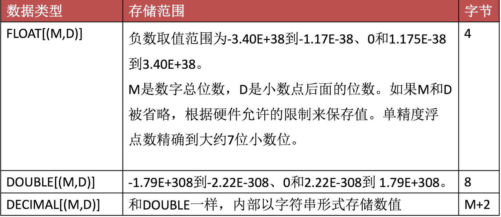
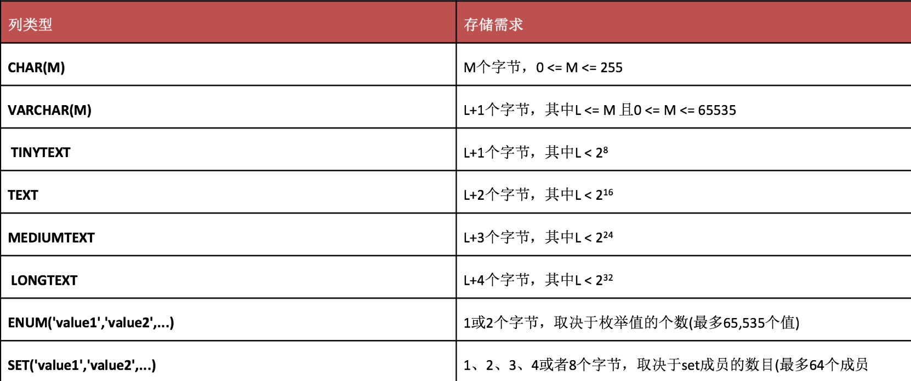
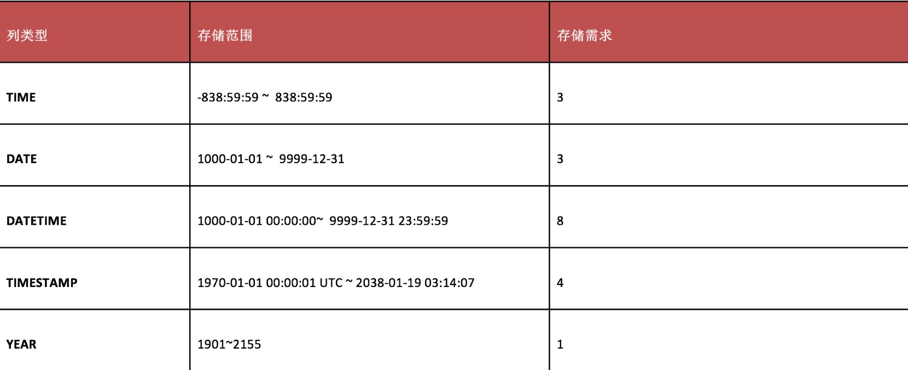
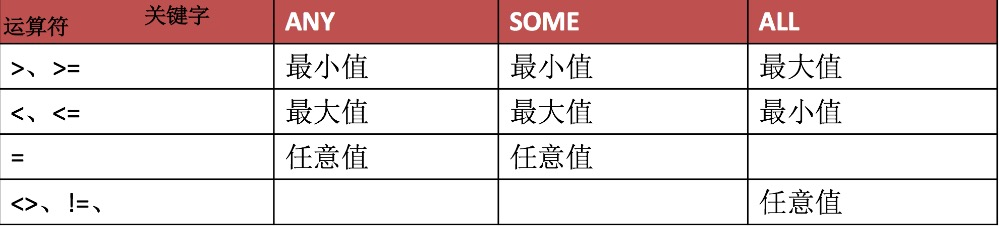

<!-- @import "[TOC]" {cmd="toc" depthFrom=1 depthTo=6 orderedList=false} -->

<!-- code_chunk_output -->

* [深入浅出MySQL数据库](#深入浅出mysql数据库)
	* [1、什么是数据库？](#1-什么是数据库)
		* [数据库(Database)是按照数据结构来组织、存储和管理数据的仓库](#数据库database是按照数据结构来组织-存储和管理数据的仓库)
		* [常见数据库](#常见数据库)
		* [相关术语](#相关术语)
	* [2、MySQL相关操作](#2-mysql相关操作)
		* [配置文件](#配置文件)
		* [登陆/退出MySQL](#登陆退出mysql)
		* [SQL语句语法规范](#sql语句语法规范)
		* [常用SQL语句](#常用sql语句)
	* [3、数据库相关操作](#3-数据库相关操作)
		* [创建数据库](#创建数据库)
		* [查看当前服务器下全部数据库](#查看当前服务器下全部数据库)
		* [查看指定数据库的详细信息](#查看指定数据库的详细信息)
		* [修改指定数据库的编码方式](#修改指定数据库的编码方式)
		* [打开指定数据库](#打开指定数据库)
		* [得到当前打开的数据库](#得到当前打开的数据库)
		* [删除指定的数据库](#删除指定的数据库)
	* [4、数据表相关操作](#4-数据表相关操作)
		* [数据表](#数据表)
		* [创建表](#创建表)
		* [查看当前数据库下已有数据表](#查看当前数据库下已有数据表)
		* [查看指定数据表的详细信息](#查看指定数据表的详细信息)
		* [查看表结构](#查看表结构)
		* [删除指定的数据表](#删除指定的数据表)
		* [表结构相关操作](#表结构相关操作)
	* [5、MySQL中的数据类型](#5-mysql中的数据类型)
		* [数值型](#数值型)
		* [字符串类型](#字符串类型)
		* [日期时间类型](#日期时间类型)
		* [二进制类型](#二进制类型)
	* [6、MySQL存储引擎](#6-mysql存储引擎)
		* [MySQL架构图](#mysql架构图)
		* [MySQL存储引擎](#mysql存储引擎)
	* [7、MySQL数据操作](#7-mysql数据操作)
		* [添加记录](#添加记录)
		* [修改记录](#修改记录)
		* [删除记录](#删除记录)
		* [查询记录](#查询记录)
		* [多表查询](#多表查询)
		* [外键约束](#外键约束)
		* [特殊形式的查询](#特殊形式的查询)
	* [8、MYSQL常用函数](#8-mysql常用函数)
		* [数学函数](#数学函数)
		* [字符串函数](#字符串函数)
		* [日期时间函数](#日期时间函数)
		* [其它常用函数](#其它常用函数)
	* [9、图形化工具管理数据库](#9-图形化工具管理数据库)
		* [BS](#bs)
		* [CS](#cs)
	* [常用SQL语句](#常用sql语句-1)
		* [查看上一步操作产生的警告信息](#查看上一步操作产生的警告信息)
		* [mysql中的注释](#mysql中的注释)
		* [检测表](#检测表)
		* [修复表](#修复表)

<!-- /code_chunk_output -->


# 深入浅出MySQL数据库

## 1、什么是数据库？

### 数据库(Database)是按照数据结构来组织、存储和管理数据的仓库

### 常见数据库


* Oracle
* DB2
* SQL Server
* Postgre SQL
* MySQL

### 相关术语

* 数据库系统(Database System):DBS
    * 数据库(Database)
    * 数据库管理系统(Database Management System):DBMS
    * 应用开发工具
    * 管理员及用户
* SQL语言
    * Structured Query Language：结构化查询与颜
        * DDL
            * 数据定义语言
        * DML
            * 数据操作语言
        * DQL
            * 数据查询语言
        * DCL
            * 数据控制语言


## 2、MySQL相关操作
### 配置文件

* my.cnf是MySQL的配置文件

### 登陆/退出MySQL

* 登陆
    * mysql -uroot -p
    * mysql -uroot -proot
    * mysql -hlocalhost -uroot -p -P3306
    * 登陆的同时修改密令提示符
        * mysql -uroot -p --prompt=命令提示符
            * \h
                * 主机
            * \u
                * 当前登陆的用户
            * \d
                * 当前打开的数据库
            * \D
                * 当前服务器的日期时间
    * 得到版本号
        * mysql -V
        * mysql --version
    * 登陆的同时打开指定数据库
        * mysql -uroot -p -D db_name
* 退出
    * exit
    * quit
    * \q
    * ctrl+c
* 登陆信息中需要掌握的
    * 命令行结束符默认使用;或者\g来结束
    * 可以通过help或者\h或者?加上相关关键字来查看手册
    * \c可以取消当前命令的执行


### SQL语句语法规范

* 常用MySQL的关键字我们需要大写，库名、表名、字段名称等使用小写
* SQL语句支持折行操作，拆分的时候不能把完整单词拆开
* 数据库名称、表名称、字段名称不要使用MySQL的保留字，如果必须要使用，需要用反引号``将其括起来


### 常用SQL语句

* SELECT USER()
    * 得到登陆的用户
* SELECT VERSION()
    * 得到MySQL的版本信息
* SELECT NOW()
    * 得到当前的日期时间
* SELECT DATABASE()
    * 得到当前打开的数据库


## 3、数据库相关操作
### 创建数据库

* CREATE {DATABASE|SCHEMA} db_name;
* 检测数据库名称是否存在，不存在则创建
    * CREATE DATABASE [IF NOT EXISTS] db_name;
* 在创建数据库的同时指定编码方式
    * CREATE DATABASE [IF NOT EXISTS] db_name [DEFAULT] CHARACTER SET [=] charset;
* 注意
    * 数据库名称最好有意义
    * 名称不要包含特殊字符或者是MySQL关键字


### 查看当前服务器下全部数据库

* SHOW DATABASES|SCHEMAS;

### 查看指定数据库的详细信息

* SHOW CREATE DATABASE db_name;

### 修改指定数据库的编码方式

* ALTER DATABASE db_name [DEFAULT] CHARACTER SET [=] charset;

### 打开指定数据库

* USE db_name;

### 得到当前打开的数据库

* SELECT DATABASE()|SCHEMA();

### 删除指定的数据库

* DROP DATABASE db_name;
* 如果数据库存在则删除
    * DROP DATABASE [IF EXISTS] db_name;

## 4、数据表相关操作
### 数据表

* 是数据库最重要的组成部分之一，数据是保存在数据表中
* 数据表由行(row)和列(column)来组成
* 每个数据表中至少有一列，行可以有零行一行或者多行组成
* 表名要求唯一，不要包含特殊字符，最好含义明确

### 创建表

* CREATE TABLE [IF NOT EXISTS] tbl_name(
    字段名称 字段类型 [完整性约束条件],
    字段名称 字段类型 [完整性约束条件],
	...
    )ENGINE=存储引擎 CHARSET=编码方式;
    * UNSIGNED
        * 无符号，没有负数，从0开始
    * ZEROFILL
        * 零填充，当数据的显示长度不够的时候可以使用前补0的效果填充至指定长度,字段会自动添加UNSIGNED
    * NOT NULL
        * 非空约束，也就是插入值的时候这个字段必须要给值,值不能为空
    * DEFAULT
        * 默认值，如果插入记录的时候没有给字段赋值，则使用默认值
    * PRIMARY KEY
        * 主键，标识记录的唯一性，值不能重复，一个表只能有一个主键，自动禁止为空
    * AUTO_INCREMENT
        * 自动增长，只能用于数值列，而且配合索引使用,默认起始值从1开始，每次增长1
    * UNIQUE KEY
        * 唯一性，一个表中可以有多个字段是唯一索引，同样的值不能重复，但是NULL值除外
    * FOREIGN KEY
        * 外键约束


### 查看当前数据库下已有数据表

* SHOW TABLES;
* SHOW [FULL] TABLES [{FROM | IN} db_name]
    [LIKE 'pattern' | WHERE expr]


### 查看指定数据表的详细信息

* SHOW CREATE TABLE tbl_name;

### 查看表结构

* DESC tbl_name;
* DESCRIBE tbl_name;
* SHOW COLUMNS FROM tbl_name;

### 删除指定的数据表

* DROP TABLE [IF EXISTS] tbl_name;

### 表结构相关操作

* 添加字段
    * ALTER TABLE tbl_name 
ADD 字段名称 字段属性 [完整性约束条件] [FIRST|AFTER 字段名称]
* 删除字段
    * ALTER TABLE tbl_name
DROP 字段名称
* 添加默认值
    * ALTER TABLE tbl_name
ALTER 字段名称 SET DEFAULT 默认值;
* 删除默认值
    * ALTER TABLE tbl_name
ALTER 字段名称 DROP DEFAULT
* 修改字段类型、字段属性
    * ALTER TABLE tbl_name
MODIFY 字段名称 字段类型 [字段属性] [FIRST | AFTER 字段名称]
* 修改字段名称、字段类型、字段属性
    * ALTER TABLE tbl_name
CHANGE 原字段名称 新字段名称 字段类型 字段属性 [FIRST | AFTER 字段名称]
* 添加主键
    * ALTER TABLE tbl_name
ADD PRIMARY KEY(字段名称)
* 删除主键
    * ALTER TABLE tbl_name
DROP PRIMARY KEY;
* 添加唯一
    * ALTER TABLE tbl_name
ADD UNIQUE KEY|INDEX [index_name] (字段名称)
* 删除唯一
    * ALTER TABLE tbl_name 
DROP index_name;
* 修改数据表名称
    * ALTER TABLE tbl_name 
RENAME [TO|AS] new_tbl_name
    * RENAME TABLE tbl_name TO new_tbl_name;
* 修改AUTO_INCREMENT的值
    * ALTER TABLE tbl_name AUTO_INCREMENT=值

## 5、MySQL中的数据类型

### 数值型

* 整数型


* 浮点型



### 字符串类型



* CHAR效率高于VARCHAR,CHAR相当于拿空间换时间，VARCHAR拿时间换空间
* CHAR默认存储数据的时候，后面会用空格填充到指定长度；而在检索的时候会去掉后面空格；VARCHAR在保存的时候不进行填充，尾部的空格会留下
* TEXT列不能有默认值,检索的时候不存在大小写转换


### 日期时间类型


### 二进制类型
## 6、MySQL存储引擎
### MySQL架构图

* MySQL是由SQL接口、解析器、优化器、缓存和存储引擎组成。
    * Connectors
        * 指的是不同语言与SQL的交互接口
    * Management Serivices & Utillities
        * 系统管理和工具
    * Connection Pool
        * 连接池，管理缓冲用户连接，线程处理等需要缓存的需求
    * SQL Interface
        * 接收用户的SQL指令，并且返回需要查询的结果。
    * Parser
        * 解析器。
    * Optimizer
        * 查询优化器
            * 选取-投影-联接
                * SELECT  id,username FROM  user WHERE age>10;
    * Caches & Buffers
        * 查询缓存
    * Engine
        * 存储引擎


### MySQL存储引擎

* 存储引擎就是指表的类型，存取和处理数据的方式。
* 查看当前支持的存储引擎
    * SHOW ENGINES;
        * ENGINE
            * 存储引擎名称
        * SUPPORT
            * 是否支持此存储引擎
        * COMMENT
            * 存储引擎的注释
        * TRANSACTIONS
            * 是否支持事务
        * XA
            * 是否支持分布式交易处理的XA规范
        * SAVEPOINTS
            * 是否支持保存点，以便事务回滚刀保存点
* 查看默认的存储引擎
    * SHOW VARIABLES LIKES 'storage_engine';
* 存储引擎分类
    * MEMORY存储引擎
        * 数据保存在内存中，读写效率高
        * 磁盘中产生一个以表明为名称.frm文件，只保存表结构
        * 如果关闭MySQL服务，此时数据会产生丢失
        * max_heap_table_size默认16MB
    * CSV存储引擎
        * CSV存储引擎字段不支持NULL，所有的的列必须设置成NOT NULL
        * CSV存储引擎不支持索引，也不支持分区
        * .csv结尾的文件是保存数据的文件
        * .csm结尾的文件是元信息文件，保存表的状态及存储的数据量
    * ARCHIVE存储引擎
        * 适合对于不经常访问又删除不了的数据做归档存储
        * .frm文件结构文件，.arz数据文件
        * 插入效率很高，而且占用空间小
        * ARCHIVE存储引擎只支持INSERT和SELECT 操作，不支持UPDATE/DELETE/REPLACE操作
    * MyISAM存储引擎
        * 默认MyISAM的表会在磁盘中产生3个文件
            * .frm
                * 表结构文件
            * .MYD
                * 数据文件
            * .MYI
                * 索引文件
        * 可以在创建表的时候指定数据文件和索引文件存储位置，只有MyISAM表支持
            * DATA DIRECORY [=] 数据保存的绝对路径
            * INDEX DIRECTORY [=] 索引文件保存的绝对路径
        * MyISAM单表最大支持的数据量2的64次方条记录
        * 每个表最多可以建立64个索引
        * 如果是复合索引，每个复合索引最多包含16个列，索引值最大长度是1000B
        * MyISAM引擎的存储格式
            * 定长(FIXED 静态) 
                * 是指字段中不包含VARCHAR/TEXT/BLOB
            * 动态(DYNAMIC)
                * 只要字段中包含了VARCHAR/TEXT/BLOB
            * 压缩(COMPRESSED)
                * myisampack创建
        * 
    * InnoDB存储引擎
        * 设计遵循ACID模型，支持事务，具有从服务崩溃中恢复的能力，能够最大限度保护用户的数据
            * 原子性(Atomiocity)
            * 一致性(Consistency)
            * 隔离性(Isolation)
            * 持久性(Durability)
        * 支持行级锁，可以提升多用户并发时的读写性能
        * 支持外键，保证数据的一致性和完整性
        * InnoDB拥有自己独立的缓冲池，常用的数据和索引都在缓存中
        * 对于INSERT、UPDATE、DELETE操作，InnoDB会使用一种change buffering的机制来自动优化，还可以提供一致性的读，并且还能够缓存变更的数据，减少磁盘I/O，提高性能
        * 
            * Storage Limits
                * 存储能力，64TB
            * MVCC
                * MVCC是一种多版本并发控制机制
            * B-Tree indexes
                * 支持B-Tree索引
            * Full-text search indexes
                * 支持
            * backup/point-in-time recovery
                * 备份/时间点恢复，支持
            * Geospatial data type support
                * 支持地理数据
        * 创建InnoDB表之后会产生两个文件
            * .frm表结构文件
            * .ibd，数据和索引存储表空间中
        * 所有的表都需要创建主键，最好是配合上AUTO_INCREMENT,也可以放到经常查询的列作为主键


## 7、MySQL数据操作
### 添加记录

* INSERT [INTO] tbl_name[(col_name,...)] {VALUE|VALUES}(VALUES...);
* 不指定字段名称
    * INSERT tbl_name VALUE(value...)
    * 需要按照建表时的字段顺序给每一个字段赋值
* 列出指定字段
    * INSERT tbl_name(字段名称,...) VALUES(值,...)
* INSERT ... SET的形式
    * INSERT tbl_name SET 字段名称=值,...;
* INSERT ... SELECT
    * INSERT tbl_name[(字段名称...)] SELECT 字段名称,... FROM  tbl_name [WHERE 条件]
* 一次添加多条记录
    * INSERT tbl_name[(字段名称,...)] VALUES(值,...),
        (值,....),
        (值,...)

### 修改记录

* UPDATE tbl_name SET 字段名称=值,字段名称=值 [WHERE 条件]
* 如果不添加条件，整个表中的记录都会被更新

### 删除记录

* DELETE FROM tbl_name [WHERE 条件]
* 如果不添加条件，表中所有记录都会被删除
* DELETE 清空数据表的时候不会重置AUTO_INCREMENT的值，可以通过ALTER 语句将其重置为1
* 彻底清空数据表
    * TRUNCATE [TABLE] tbl_name;
        * 清除表中所有记录
        * 会重置AUTO_INCREMENT的值


### 查询记录

* SELECT select_expr,... FROM tbl_name
[WHERE 条件]
[GROUP BY {col_name|position} HAVING 二次筛选]
[ORDER BY {col_name|position|expr} [ASC|DESC]]
[LIMIT 限制结果集的显示条数] 
* 查询表中所有记录
    * SELECT * FROM tbl_name;
        * *所有字段
* 指定字段的信息
    * SELECT 字段名称,... FROM tbl_name
* 库名.表名
    * SELECT 字段名称,... FROM db_name.tbl_name;
* 给字段起别名
    * SELECT 字段名称 [AS] 别名名称,... FROM db_name.tbl_name; 
* 给数据表起别名
    * SELECT 字段名称 ,... FROM tbl_name [AS] 别名;
* 表名.字段名的
    * SELECT tbl_name.col_name,... FROM tbl_name;
* WHERE 条件
    * 会筛选出符合条件的记录
        * 比较运算符
            * >、>= 、<、 <=、 !=、 <>、 <=>
            * `=` 与 `<=>`相似，<=>可以检测NULL值
            * 不等于运算符 <> 或者 !=
        * IS [NOT] NULL
            * 检测值是否为NULL或者NOT NULL
        * 指定范围
            * [NOT] BETWEEN ... AND
        * 指定集合
            * [NOT] IN(值,...)
        * 逻辑运算符
            * AND
                * 逻辑与
            * OR
                * 逻辑或
        * 匹配字符
            * [NOT] LIKE
            * %
                * 任意长度的字符串
            * _
                * 任意一个字符
* GROUP BY 分组
    * 把值相同放到一个组中，最终查询出的结果只会显示组中一条记录
    * 分组配合GROUP_CONCAT()查看组中某个字段的详细信息
    * 配合聚合函数使用
        * COUNT()
            * 统计记录总数
            * 如果写的是COUNT(字段名称)，字段中的值为NULL，不统计进来
            * 写COUNT(*)会统计NULL值
        * SUM()
            * 求和
        * MAX()
            * 求最大值
        * MIN()
            * 求最小值
        * AVG()
            * 求平均值
    * 配合WITH ROLLUP关键使用
        * 会在记录末尾添加一条记录，是上面所有记录的总和
    * HAVING子句对分组结果进行二次筛选
* ORDER BY 排序
    * ORDER BY 字段名称 ASC|DESC
* LIMIT 限制结果集显示条数
    * LIMIT 值
        * 显示结果集的前几条记录
    * LIMIT offset,row_count
        * 从offset开始，显示几条记录,offset从0开始


### 多表查询

* 笛卡尔积的形式
* 内连接的形式
    * 查询两个表中符合连接条件的记录
    * SELECT 字段名称,... FROM tbl_name1
INNER JOIN tbl_name2
ON 连接条件
* 外连接的形式
    * 左外连接
        * SELECT 字段名称,... FROM tbl_name1
            LEFT [OUTER] JOIN tbl_name2
            ON 条件;
        * 先显示左表中的全部记录，再去右表中查询复合条件的记录，不符合的以NULL代替
    * 右外连接
        * SELECT 字段名称,... FROM tbl_name1
            RIGHT [OUTER] JOIN tbl_name2
            ON 条件;
        * 先显示右表中的全部记录，再去左表中查询复合条件的记录，不符合的以NULL代替


### 外键约束

* 只有InnoDB存储引擎支持外键
* 创建外键
    * 建表时指定外键
        * [CONSTRAINT 外键名称 ]FOREIGN KEY(字段名称) REFERENCES 主表(字段名称)
        * 子表的外键字段和主表的主键字段类型要相似；如果是数值型要求一致，并且无符号也要一致；如果是字符型，要求类型一致，长度可以不同
        * 如果外键字段没有创建索引，MySQL会自动帮我们添加索引
        * 子表的外键关联的必须是父表的主键
        * 外键约束的参照操作
            * CASCADE
                * 从父表删除或更新，子表也跟着删除或者更新，级联的操作
            * SET NULL
                * 从父表删除或者更新记录，并设置子表的外键列为NULL。
            * NO ACTION | RESTRICT
                * 拒绝对父表做更新或者删除操作
    * 动态添加外键
        * 动态添加外键
            * ALTER TABLE tbl_name
                [CONSTRAINT 外键名称] ADD FOREIGN KEY(外键字段) REFERENCES 主表(主键字段);
            * 动态添加外键之前表中的记录一定合法的记录，没有脏值，否则外键添加不成功
        * 动态删除外键
            * ALTER TABLE tbl_name
DROP FOREIGN KEY fk_name;

### 特殊形式的查询

* 子查询
    * SELECT 字段名称 FROM tbl_name WHERE col_name=(SELECT col_name FROM tbl_name)
    * 内层语句查询的结果可以做为外层语句查询的条件
    * 由IN引发的子查询
    * 由比较运算符引出子查询
    * 由EXISTS引发的子查询
    
    * ANY SOME ALL
    * INSERT ... SELECT
    * CREATE ... SELECT
    * CREATE TABLE tbl_name LIKE tbl_name;
* 联合查询
    * UNION
        * SELECT 字段名称,... FROM tbl_name1 
            UNION
            SELECT 字段名称... FROM tbl_name2;
    * UNION ALL
        * SELECT 字段名称,... FROM tbl_name1 
            UNION ALL
            SELECT 字段名称... FROM tbl_name2;
    * UNION ALL 是简单的合并，UNION会去掉表中重复记录
* 自身连接查询
    * 无限级分类的实现形式
* 正则表达式查询
    * 正则表达式的模式字符
        * ^
            * 匹配字符串开始的部分
        * $
            * 匹配字符串结束部分
        * .
            * 代表一个任意字符
        * [字符集合]
            * [abc] [a-z] [0-9]
        * [\^字符集合]
            * 除了集合中的内容
        * s1|s2|s3
            * 匹配s1或者s2或者s3
        * *
            * 代表匹配前面的字符0次1次或者多次
        * +
            * 代表匹配前面的字符至少出现1次
        * 字符{n}
            * 前面的字符正好出现n次
        * 字符{m,n}
            * 前面的字符至少出现m次，最多出现n次
    * REGEXP '匹配方式'
        * SELECT 字段名称,... FROM tbl_name WHERE 字段名称 REGEXP '匹配模式'

## 8、MYSQL常用函数
### 数学函数

* CEIL()
    * 进一取整
* FLOOR()
    * 舍掉小数部分
* ROUND()
    * 四舍五入
* TRUNCATE()
    * 截取小数点后几位
* MOD()
    * 取余数
* ABS()
    * 取绝对值
* POWER()
    * 幂运算
* PI()
    * 圆周率
* RAND()或者RAND(X)
    * 0~1之间的随机数
* SIGN(X)
    * 得到数字符号
* EXP(X)
    * 计算e的x次方


### 字符串函数

 - CHAR_LENGTH():得到字符串的字符数
 - LENGTH():返回字符串的字节长度

```sql
select char_length('你好啊');
+--------------------------+
| char_length('你好啊')    |
+--------------------------+
|                        3 |
+--------------------------+


mysql> select length("你好啊");
+---------------------+
| length("你好啊")    |
+---------------------+
|                   9 |
+---------------------+
```

 - CONCAT(s1,s2,....):将字符串合并成一个字符串，含有`null`结果返回`null`。
 - CONCAT_WS(x,s1,s2,s2....)：以指定分隔符拼接字符串(`x`)，含有`null`就转换成空字符。


 - UPPER()| UCASE() LOWER()|LCASE(): 将字符串转换成大写或者小写 
 - REVERSE(): 字符串的反转
 - LEFT()|RIGHT(): 返回字符串的前几个字符或者后几个字符

```sql
SELECT LEFT('hello',2),RIGHT('hello',2);
```

 - LPAD()|RPAD(): 用字符串填充到指定长度

```sql
SELECT LPAD('abc',10,'?');
```

 - 去掉字符串两端/左边/右边的空格TRIM()|LTRIM()|RTRIM():
 - REPEAT(): 重复指定的次数
 - REPLACE(): 替代字符串

```sql
select replace('hello world', 'hello', 'hei');
+----------------------------------------+
| replace('hello world', 'hello', 'hei') |
+----------------------------------------+
| hei world                              |
+----------------------------------------+
```

 - SUBSTRING(str, start, to): 截取字符串

```sql
SELECT SUBSTRING('abcdefg',1,5);

-- 从1开始
+--------------------------+
| SUBSTRING('abcdefg',1,5) |
+--------------------------+
| abcde                    |
+--------------------------+
```

 - STRCMP(str, str): 比较字符串的ASCII顺序。
    第一个大于第二个返回`1`;
    第一个小于第二个返回`-1`;
    第一个等于第二个返回`0`;


### 日期时间函数

```sql
-- 返回当前日期
SELECT CURDATE(),CURRENT_DATE();

-- 返回当前时间
SELECT CURTIME(),CURRENT_TIME();

-- 返回当前的日期时间
SELECT NOW(),CURRENT_TIMESTAMP(),SYSDATE();

-- 返回日期中的月份和月份的名称
SELECT MONTH('2017-02-19');
SELECT MONTH(CURDATE()),MONTHNAME(CURDATE());

-- 返回星期几
SELECT DAYNAME(NOW());

-- 返回一周内的第几天,0代表星期一
SELECT DAYOFWEEK(NOW());
SELECT WEEK(NOW());
SELECT YEAR(NOW()),MONTH(NOW()),DAY(NOW()),HOUR(NOW()),MINUTE(NOW()),SECOND(NOW());

-- DATEDIFF()计算两个日期相差的天数
SELECT DATEDIFF('2017-03-06','2017-03-02');
```
> http://wiki.jikexueyuan.com/project/mysql/useful-functions/time-functions.html

### 其它常用函数

```sql
-- 测试其它常用函数，版本、连接数
SELECT VERSION(),CONNECTION_ID();

SELECT USER(),CURRENT_USER(),SYSTEM_USER(),SESSION_USER();

-- 得到上一步插入操作产生AUTO_INCREMENT的值
SELECT LAST_INSERT_ID();

SELECT MD5('king');
SELECT SHA('king');
-- PASSWORD():密码加密算法
SELECT PASSWORD('root');
```

## 9、图形化工具管理数据库

### BS
* phpmyadmin


### CS

* Sequel Pro
* windows
    * SQLyog
    * navit for mysql
    * mysql front
    * mysql workbench


## 常用SQL语句
### 查看上一步操作产生的警告信息

* SHOW WARNINGS;

### mysql中的注释

```sql
# 注释内容
-- 注释内容
```
### 检测表
* CHECK TABLE tbl_name


### 修复表
* REPAIR TABLE tbl_name


